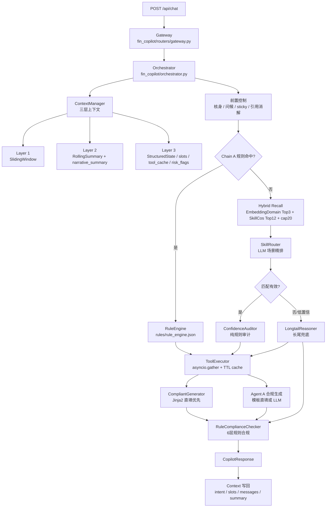

# 维信话术推荐系统 4.25

---

## 1. 概述

当前版本已经从早期 RAG-first demo 演进为 **Skill-based 三链路坐席话术推荐系统**。系统不再把 SOP 拍平成纯文本 chunk 作为主知识源，而是将业务场景、触发条件、工具依赖、模板话术、分支条件、合规规则统一封装为 `Skill YAML`，由运行时编排器按确定性优先原则选择链路。

总体链路如下：

```text
客户输入
  → L0 预处理 / 引用消解 / 风险与槽位抽取
  → 核身前置检查 / 问候结束语 / 短追问粘滞
  → Chain A：规则短路，零 LLM
  → Chain B：Hybrid Recall + LLM Skill Routing + 工具 + 合规生成
  → Chain C：长尾兜底，工具辅助 + 加严合规
  → 后置合规检查
  → 三层上下文写回
```

当前版本的实现重点是：

- 用 `54` 个 skill 覆盖 `10` 个业务域 + `1` 个会话流程域。
- 用 `9` 条 Chain A 规则承接高频、确定性、可模板化场景。
- 用 `11` 个工具模拟客户档案、账单、贷款、会员、额度、退款、短信、通话、停催、工单等坐席辅助查询能力。
- 对涉及个人账户数据的查询统一进入核身层，支持分步核身与“一句话核身”。
- 对多轮对话增加短追问粘滞、引用消解、重复回复保护、叙事摘要。
- 对细粒度 skill 混淆增加 `boundary_rules.yaml` 动态拼接规则，支撑 Router 精排优化。

---

## 2. 当前版本系统框架



---

## 3. 三条业务链路设计

### 3.1 Chain A：规则短路链路

Chain A 面向高频、确定性、模板可直填的场景，目标是零 LLM、低时延。

当前 `rules/rule_engine.json` 配置了 `9` 条规则：

| rule_id | skill_id | 典型触发 |
|---|---|---|
| `RULE_001` | `stop_marketing` | 别打电话、停止营销、不要推销 |
| `RULE_002` | `value_added_service_inquiry` | 增值服务是什么、安心保障 |
| `RULE_003` | `clearance_certificate` | 结清证明、还款证明 |
| `RULE_004` | `account_cancellation` | 注销账户、删除账号 |
| `RULE_005` | `member_cancel` | 取消会员、关闭会员 |
| `RULE_006` | `repayment_method_inquiry` | 怎么还款、还款二维码、对公还款账号 |
| `RULE_007` | `stop_collection` | 停止催收、要求停催 |
| `RULE_008` | `overdue_negotiation` | 协商还款、延期、二次分期、减免利息 |
| `RULE_009` | `bill_deduction_query` | 查账单、查欠款、未还款总金额 |

执行流程：

```text
query
  → RuleEngine.match()
  → 命中 skill_id + template_variant
  → 若需要账户数据且未核身，启动核身
  → 执行 required tools
  → CompliantGenerator 优先 Jinja2 直填模板
  → RuleComplianceChecker 后置合规
  → 返回 route_a
```

当前实现里，Chain A 虽然叫规则短路，但生成仍复用 `CompliantGenerator`：如果模板槽位完整，则零 LLM 直填；如果槽位缺失，才退到 LLM 生成。

### 3.2 Chain B：Skill 路由主链路

Chain B 是标准场景的主链路，承担大多数非规则命中的业务咨询。

执行流程：

```text
query
  → embed query 一次
  → EmbeddingDomainClassifier 计算 domain Top-3 与 domain_cos
  → SkillEmbeddingIndex 计算 skill_cos Top-12
  → 候选集合 = domain Top-3 下的 skills ∪ skill_cos Top-12 skills
  → 去重 + prior_score 排序 + cap20
  → SkillRouter.route_over_candidates()
      - 注入候选 skill
      - 注入 skill_cos / domain_cos / prior_score 弱先验
      - 注入最近对话、叙事摘要、事件日志
      - 注入当前场景/轮次/已收集槽位/缺失槽位
      - 动态注入 boundary_rules
      - 可选注入 few-shot 相似案例
  → 若 none 或极低置信，进入 Chain C
  → 若涉及账户数据且未核身，启动核身
  → 合并 extracted_slots
  → 并行执行工具
  → ConfidenceAuditor 纯规则审计
  → branch_conditions 选择模板变体或提示 Agent A
  → CompliantGenerator 生成话术
  → RuleComplianceChecker 后置合规
  → 重复回复保护
  → 返回 route_b
```

#### Skill Router 的当前策略

`skills/prompts/skill_routing.md` 的核心要求是：

- `skill_id` 必须来自候选列表，禁止编造或返回 tool 名称。
- 优先延续当前场景，短追问保持当前 skill。
- 候选相关时强制择一，用 `confidence` 表示不确定性。
- `skill_cos` / `domain_cos` 只作为弱先验，不能覆盖明确触发词、排除词、业务边界规则或上下文状态。
- 输出 Top-1 + alternatives，供坐席与后续链路参考。

当前 Router 还加载 `skills/prompts/boundary_rules.yaml`。只有当当前候选中包含某个混淆簇内至少 2 个 skill 时，才将该簇规则拼入 prompt，避免模型看到候选外 skill 后产生幻觉。

已配置混淆簇：

- 扣款簇：`deduction_issues` / `repayment_status_issue` / `bill_deduction_query` / `fee_detail_query`
- 催收簇：`stop_collection` / `collection_complaint` / `post_loan_verification` / `stop_marketing` / `overdue_negotiation`
- 还款结果簇：`repayment_result_query` / `repayment_status_issue`
- 还款方式簇：`repayment_method_inquiry` / `card_rebinding` / `repayment_status_issue`

#### Hybrid Recall 与 Skill-level Cosine 候选扩展

为提升 Chain B 的候选覆盖，当前主链路与离线评测链路都使用 `SkillEmbeddingIndex`：

```text
query
  → embed query 一次
  → query ↔ domain centroid 计算 domain_cos Top-K
  → query ↔ skill centroid 计算 skill_cos Top-M
  → 合并候选：domain Top-K skills ∪ skill_cos Top-M skills
  → 按 prior_score 排序
  → 截断到 max_candidates
  → 送入 SkillRouter
```

`skill` centroid 由 skill 的名称、领域、意图层级、description、keywords、examples、模板名、工具名拼接后 embedding 得到。当前默认配置为：

```text
SKILL_MULTI_DOMAIN_K=3
SKILL_COS_TOP_M=12
SKILL_MAX_CANDIDATES=20
SKILL_CANDIDATE_SOURCE=hybrid
```

该方案不是用 skill-cos 替代域召回，而是以 `domain Top3` 作为主召回底盘，用 `skill-cos Top12` 做低成本补召回与排序弱先验。实际送入 Router 的候选会先去重，再按 `prior_score` 排序并截断到最多 20 个，因此不会把 `domain skills + 12` 原样膨胀给 LLM。

当前 `prior_score` 是用于候选排序和 prompt 展示的弱先验：

```text
prior_score = 0.65 * skill_cos
            + 0.25 * domain_cos_of_skill_domain
            + 0.10 * keyword_overlap
```

这个分数不直接替代 LLM 决策。Router prompt 会提示模型把它作为语义相似度参考，在触发词、排除词、混淆簇规则和上下文状态更明确时，以业务边界为准。

| 候选来源                | Top1       | Top3       | 候选覆盖口径                |
| :---------------------- | :--------- | :--------- | :-------------------------- |
| 只看 Domain Top3        | 74.03%     | 88.33%     | Domain Top3 覆盖 94.59%     |
| 只看 Skill-cos Top12    | 75.19%     | 89.25%     | Skill-cos Top12 覆盖 95.57% |
| **Hybrid k3/m12/cap20** | **76.11%** | **90.79%** | **合并候选覆盖约 98.14%**   |

#### Agent B：置信审计

`ConfidenceAuditor` 是纯规则审计，不调用 LLM。评分从 1.0 开始扣分：

- LLM 置信度低于 0.7。
- L1 域与 skill.domain 不一致。
- 模板 required slots 缺失。
- template_variant 不存在。
- required tool 未调用或失败。
- query 与 skill keywords 无重叠。

分数低于阈值时，返回安全兜底或转人工建议。

### 3.3 Chain C：长尾兜底链路

Chain C 处理无 skill 覆盖、Router 极低置信、候选无效等场景。它的定位不是强行回答，而是“工具辅助、谨慎生成、明确标注无 SOP 覆盖”。

执行流程：

```text
query
  → LongtailReasoner._suggest_tools()
  → 如果建议工具涉及账户信息且未核身，先核身
  → 已核身则执行只读工具
  → LLM 长尾推理
  → 后置合规 is_longtail=True
  → 强制追加“以上信息仅供参考，具体以业务确认为准”
  → 返回 route_c_fallback + warning
```

当前 Chain C 中的 RAG 仍是占位口径，prompt 中传入的是“无 SOP 参考”。也就是说，当前版本的长尾链路主要依赖 LLM + 工具结果 + 加严合规，而不是实际向量检索。

---

## 4. 上下文与多轮对话设计

当前版本采用三层上下文：

| 层 | 实现 | 内容 | 用途 |
|---|---|---|---|
| Layer 1 | `SlidingWindow` | 最近 N 轮客户/坐席原文，默认 8 轮 | 给 Router 和 Generator 提供近期上下文 |
| Layer 2 | `RollingSummary` | 事件日志 + `narrative_summary` | 压缩较早上下文，保留意图切换、工具调用、槽位进展 |
| Layer 3 | `StructuredStateManager` | customer、intent、slots、tool_cache、risk_flags、compliance_state | 决策、工具缓存、模板填充、核身与风控 |

多轮能力增强：

- `intent.current_skill_id` + `turn_in_skill` 支持递进话术。
- `DialogueStateManager.should_stick()` 对短追问复用上一 skill 的 `follow_up`。
- `resolve_references()` 对短句指代做保守改写，例如“这个多少钱”可绑定到上一轮账单金额。
- `duplicate_ratio()` 防止连续输出高度相似的话术。
- 意图切换时清理场景专属槽位，只保留姓名、手机号、客户诉求等通用槽位。

---

## 5. Skill 组织形式

### 5.1 Skill 总体规模

当前 `skills/registry.json` 登记 `54` 个 skill，分布如下：

| 域 | 数量 | skill_id |
|---|---:|---|
| 会话流程 | 5 | `greeting_opening`, `identity_readback`, `acknowledgement`, `channel_check`, `closing` |
| 账户 | 3 | `account_cancellation`, `deactivated_customer_service`, `special_account_cancellation` |
| 还款 | 8 | `bill_date_credit_impact`, `card_rebinding`, `deduction_issues`, `early_deduction`, `early_loan_clearance`, `repayment_method_inquiry`, `repayment_result_query`, `repayment_status_issue` |
| 费用 | 9 | `bill_deduction_query`, `fee_consultation_tier1`, `fee_consultation_tier2`, `fee_detail_query`, `fee_refund_status`, `fee_refund_tier1`, `fee_refund_tier2`, `loan_dispute_refund`, `overpayment_refund` |
| 业务办理 | 7 | `cancel_credit_authorization`, `clearance_certificate`, `contract_retrieval`, `credit_inquiry`, `credit_modification`, `invoice_issuance`, `other_certificate` |
| 活动 | 5 | `cancel_value_added_service`, `light_card_cancel_refund`, `refund_value_added_service`, `stop_marketing`, `value_added_service_inquiry` |
| 逾期 | 5 | `close_pre_reminder`, `collection_complaint`, `overdue_negotiation`, `post_loan_verification`, `stop_collection` |
| 贷款 | 4 | `disbursement_progress`, `loan_consultation`, `loan_termination`, `remote_disbursement` |
| 会员 | 3 | `member_cancel`, `member_consultation`, `member_refund` |
| 额度 | 2 | `no_quota_issue`, `quota_consultation` |
| 优享卡 | 3 | `premium_card_cancel`, `premium_card_inquiry`, `premium_card_refund` |

按路由模式：

| route_mode | 数量 | 说明 |
|---|---:|---|
| `direct_reply` | 9 | 低风险、无需工具或可直接给通用话术 |
| `tool_only` | 39 | 需要工具数据，但主要靠模板和规则生成 |
| `tool_rag` | 6 | 复杂场景，保留 RAG链路补充，主知识仍来自 skill |

按风险等级：

| risk_level | 数量 |
|---|---:|
| `low` | 17 |
| `medium` | 25 |
| `high` | 12 |

### 5.2 Skill 目录结构

```text
skills/
├── registry.json
├── SCHEMA.md
├── definitions/
│   ├── overdue_negotiation.yaml
│   ├── bill_deduction_query.yaml
│   └── ... 共 54 个
├── prompts/
│   ├── skill_routing.md
│   ├── compliant_gen.md
│   ├── longtail_reasoning.md
│   └── boundary_rules.yaml
└── references/
    └── compliance/
        ├── forbidden_words.json
        ├── key_rules.json
        └── longtail_constraints.json
```

### 5.3 单个 Skill 的结构

每个 `skills/definitions/*.yaml` 是一个完整业务能力单元，主要字段包括：

| 字段 | 作用 |
|---|---|
| `skill_id` / `name` / `description` | 标识、展示名称、业务边界说明 |
| `domain` / `intent_hierarchy` | L1 域与多级意图层级 |
| `route_mode` / `risk_level` | 路由模式与风险等级 |
| `triggers` | 关键词、正例、排除词，用于 Router prompt 和规则判断 |
| `tools` | required / optional 工具依赖 |
| `templates` | 多轮或多变体话术模板，含 required_slots 与 next_step |
| `branch_conditions` | 基于槽位表达式或自然语言 hint 的分支条件 |
| `compliance` | skill 级禁用表达、免责声明、条件性必含内容 |
| `escalation` / `escalation_signals` | 转人工或升级信号 |
| `fallback` | 安全兜底话术 |
| `slot_sources` | 模板占位符的数据来源说明 |
| `priority` | 歧义场景优先级 |

### 5.4 SOP 到 Skill 的组织关系

当前版本基本完成 SOP → Skill 的结构化迁移：

- `48` 个业务 skill 与 `48` 份 QA SOP 一一对应。
- `1` 个 skill 为一对多合并：`repayment_status_issue` 合并“还款失败怎么处理”和“已还款怎么没更新”。
- `5` 个会话流程 skill 是从多个 SOP 共性步骤抽象出来的新增能力：开场、核身、确认、通话状态、结束语。
- 没有业务 QA 场景被完全删除；

---

## 6. 示例 Skill 内容

### 6.1 示例一：`bill_deduction_query` 查询账单扣款情况

这是一个典型 `tool_only` skill，适合展示“核身 + 工具查询 + 模板填充”的形态。

```yaml
skill_id: bill_deduction_query
name: 查询账单扣款情况
domain: 费用
route_mode: tool_only
risk_level: medium

triggers:
  keywords:
    - 账单扣款
    - 扣款情况
    - 查账单
    - 查询账单
    - 查欠款
    - 未还款总金额
    - 账单明细
  examples:
    - 查询账单扣款情况
    - 这个月账单扣款了吗
    - 我想查一下账单情况
    - 我想查询我的账户中有几笔订单
  exclude_keywords:
    - 退费
    - 还款失败
    - 重复扣款
    - 多扣了

tools:
  required:
    - get_customer_profile
    - get_bill_and_repayment_plan
  optional:
    - get_loan_service_info

templates:
  first_contact:
    script: |
      为了确保信息安全，跟您简单核对几项基本资料，请问您的{verification_info}？
    required_slots:
      - verification_info
    next_step: verify_identity

  follow_up:
    script: |
      {customer_name}，您好。这边已为您查询了账单扣款情况。
      您当前账单期次：第{bill_period}期，账单金额：{bill_amount}元，还款日：{due_date}。
      扣款状态：{deduction_status}。
      {deduction_detail}
      如有疑问欢迎随时联系我们。
    required_slots:
      - customer_name
      - bill_period
      - bill_amount
      - due_date
      - deduction_status
      - deduction_detail
    next_step: ask_other_questions

branch_conditions:
  - hint: 账单已扣款成功
    variant: deduction_success
    note: 告知扣款成功时间和金额，账单已更新
  - hint: 账单待扣款，未到还款日
    variant: deduction_pending
    note: 告知还款日及预计扣款时间，提醒保持余额充足
  - hint: 账单扣款失败
    variant: deduction_failed
    note: 转入还款失败处理流程，定位失败原因

compliance:
  forbidden_expressions:
    - 不会逾期
    - 保证扣款成功
    - 随便什么时候还都行
  required_disclaimer: 请在还款日前确保绑定银行卡余额充足，避免因余额不足导致扣款失败影响信用记录。

slot_sources:
  customer_name: tool:get_customer_profile.name
  bill_amount: tool:get_bill_and_repayment_plan.amount
  bill_period: tool:get_bill_and_repayment_plan.period
  due_date: tool:get_bill_and_repayment_plan.due_date
  deduction_status: tool:get_bill_and_repayment_plan.deduction
  deduction_detail: tool:get_bill_and_repayment_plan.deduction
  verification_info: derived:verification_info
```

该 skill 的典型运行链路：

```text
客户：帮我查一下账单
  → Chain A 命中 RULE_009 或 Chain B 匹配 bill_deduction_query
  → 判断 required tools 涉及账户数据，未核身则启动核身
  → 核身通过后执行 get_customer_profile + get_bill_and_repayment_plan
  → follow_up 模板直填
  → 追加还款日前余额充足的合规提示
```

### 6.2 示例二：`overdue_negotiation` 协商还款

这是一个高风险 `tool_rag` skill，重点体现递进话术、逾期天数分支和强合规约束。

```yaml
skill_id: overdue_negotiation
name: 协商还款
domain: 逾期
route_mode: tool_rag
risk_level: high

description: |
  处理客户逾期还款协商诉求，了解困难原因，提供还款方案建议。
  与 stop_collection 的区别：本场景客户想谈“怎么还”，stop_collection 是客户想谈“别再催了”。
  与 collection_complaint 的区别：本场景是客户主动想协商，collection_complaint 是客户投诉催收行为。

triggers:
  keywords:
    - 协商还款
    - 延期还款
    - 还不上
    - 二次分期
    - 还款困难
    - 只还本金
    - 减免利息
  exclude_keywords:
    - 停催
    - 投诉催收
    - 征信
    - 提前清贷

tools:
  required:
    - get_customer_profile
    - get_bill_and_repayment_plan
  optional:
    - get_loan_service_info
    - query_ticket
    - submit_ticket

templates:
  first_contact:
    script: >
      {customer_name}，您好，相信您自己肯定也是不希望逾期的，并且您能主动致电我们客服进行沟通，
      也能感受到您是有还款意愿的，所以冒昧了解下，您这边是什么原因导致自己无法还款了呢？
      大概什么时候可以还款呢？
    required_slots:
      - customer_name
    next_step: 了解困难原因后，根据是否已逾期判断分支处理

  follow_up:
    script: >
      {customer_name}，您刚才诉说的情况，作为个人来说，我也是非常能够理解……
      目前逾期金额为{overdue_amount}元，逾期{overdue_days}天，请问您大概什么时候能够还款呢？
    required_slots:
      - customer_name
      - overdue_amount
      - overdue_days
    next_step: 根据客户还款意愿决定是否发单给贷后专员

branch_conditions:
  - expr: overdue_days == 0
    variant: pre_overdue
    note: 未逾期客户协商延期，婉拒延期，提醒征信影响
  - expr: overdue_days <= 30
    variant: early_overdue
    note: 逾期1-30天，了解原因，发单时效1-2工作日
  - expr: overdue_days > 30 and overdue_days <= 90
    variant: mid_overdue
    note: 逾期31-90天，可申请二次分期，需困难凭证
  - expr: overdue_days > 90
    variant: severe_overdue
    note: 逾期90天以上，委外/法诉阶段

compliance:
  forbidden_expressions:
    - 保证帮您延期
    - 可以不还
    - 暂时不用还
    - 征信没关系
    - 我们不会上报征信
    - 保证停止催收
  required_disclaimer: 逾期将影响您的个人征信记录，并产生相应逾期费用，请尽快处理。
```

---

## 7. 当前评测口径与效果

基于未清洗的2846条原始数据，使用llm标注、提取首句意图的方式，构建了系统链路测试集（非最终测试集，仅作为系统调试、链路优化参考），覆盖 48 个 skill。

| 指标 | 当前结果 | 解读 |
|---|---:|---|
| Exp1 L1 域分类 Top-1 | 76.60% | 单域首选仍一般，不适合只用 Top1 domain 做候选 |
| Exp1 L1 域分类 Top-3 | 94.59% | `multi-domain-k=3` 的域召回底盘已可用 |
| Exp2 Skill-cos Top12 recall | 95.57% | skill-level cosine 可直接覆盖大多数 gold skill，作为补召回 |
| Exp2 Skill Router Top-1 | 76.11% | hybrid 候选下 LLM Router 第一选择命中率 |
| Exp2 Skill Router Top-3 | 90.79% | 正确 skill 大多数能进入 Router 前三 |
| Exp2 Top-1 \| domain-covered | 77.60% | 在 gold domain 被 L1 Top3 覆盖时的 Router Top1 |
| Exp2 Top-3 \| domain-covered | 92.76% | 在 gold domain 被 L1 Top3 覆盖时的 Router Top3 |

Exp3 路由分布：

| 路由 | 数量 | 占比 | 解读 |
|---|---:|---:|---|
| `route_b` | 2406 | 84.5% | 主体业务问题主要走 hybrid Skill Router |
| `route_a` | 415 | 14.6% | 高频规则短路仍有效 |
| `route_c_fallback` | 25 | 0.9% | 长尾兜底占比较低，skill 覆盖较充分 |

当前主要瓶颈不在候选召回，而在细粒度 skill 精排和输出稳定性：

- 催收簇：投诉催收、停止催收、核实贷后信息、协商还款。
- 扣款簇：账单扣款查询、扣款异常、还款状态异常、费用明细。
- 征信簇：征信查询、征信修改、账单日还款是否影响征信。
- 会员簇：会员咨询、取消会员、退会员费。

