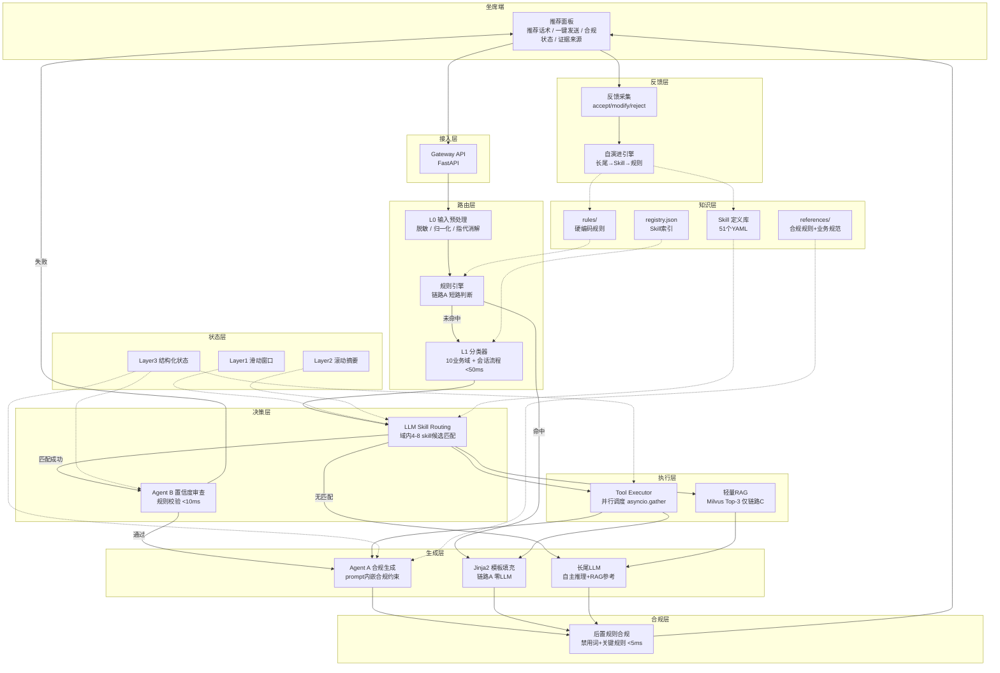

# 金融客服坐席话术推荐系统 — 技术方案设计文档

> 版本：v1.0  
> 日期：2026-04-09  
> 状态：评审稿

---

## 1. 项目背景与目标

### 1.1 业务场景

本系统面向金融客服场景中的**人工坐席**，提供实时话术推荐、信息查询辅助、应答生成与合规质检。核心定位不是面向最终客户的客服机器人，而是**辅助人工坐席提高应答效率和合规水平的 Copilot 系统**。

业务覆盖 10 个业务域，并另设 1 个会话流程域；当前共 54 个细分 Skill。业务域包括：会员、额度、还款、贷款、费用、活动、业务办理、账户、逾期、优享卡。数据分布高度集中——Top-20 场景占比 75%，Top-40 占比 91%，长尾场景占比约 9%。

### 1.2 原有 Demo 的核心问题

原有方案采用 `场景匹配 → RAG 模板检索 → LLM 模板填充 → LLM 合规质检` 的串行链路，存在四个结构性缺陷：

| 问题 | 根因 | 影响 |
|------|------|------|
| **递进话术无法区分** | SOP 被拍平为 874 个文本 chunk，丢失决策树/状态机结构。同一场景首次/二次/三次沟通的话术不同，但 RAG 只看 query 相似度，无法感知沟通轮次 | 返回错误轮次的模板 |
| **时延不可接受** | 典型 tool_rag 路径含 3 次串行本地 7B 推理（意图分类 + 受控生成 + 合规质检），端到端 4-8s | 远超坐席辅助场景 P95 < 2s 的要求 |
| **错误级联** | 严格串行管道，任一环节出错后续无法修正。LLM 被限制为"模板填充器"角色，无法判断模板本身是否正确 | 场景或模板匹配错误直接传导到最终输出 |
| **强依赖 RAG** | RAG 是话术的唯一知识来源，检索失败时只能输出笼统兜底话术 | 缺少降级路径 |

### 1.3 为什么从 RAG-first 转向 Skill-based

**核心判断：** 坐席话术推荐系统的知识不是"检索问题"，而是"决策问题"。SOP 本质上是一组有状态、有分支、有约束的决策流程，不适合被拍平为向量 chunk 做相似度匹配。

Skill-based 方案将 SOP 的场景定义、递进模板、工具约束、合规规则**编译**为结构化的 Skill 定义，直接嵌入 LLM 上下文，由 LLM 一次完成"场景匹配 + 工具选择 + 话术选择"，消除了检索、排序、模板填充、合规审查的多步串行链路。

### 1.4 系统目标

**业务目标：**

| 指标 | 目标值 | 说明 |
|------|--------|------|
| 话术推荐采纳率 | >= 60% | 坐席直接使用或微调后使用 |
| 场景匹配 TOP1 准确率 | >= 85% | 覆盖 Top-40 场景 |
| 关键合规通过率 | >= 96% | 与业务介绍 PDF 中定义的关键因素对齐 |
| 非关键合规通过率 | >= 98% | 与业务介绍 PDF 中定义的非关键因素对齐 |

**工程目标：**

| 指标 | 目标值 | 说明 |
|------|--------|------|
| 高频场景端到端时延 | < 200ms (P95) | 规则短路链路 |
| 标准场景端到端时延 | < 2s (P95) | Skill 路由主链路 |
| 长尾场景端到端时延 | < 3s (P95) | 自主推理 + RAG 辅助链路 |
| 新场景接入周期 | < 1 人天 | 编写 Skill YAML 即可，不改代码 |
| 系统可用性 | >= 99.5% | 单点故障可降级 |

---

## 2. 设计原则

| 原则 | 含义 | 对应设计决策 |
|------|------|------------|
| **Skill-first** | 知识以结构化 Skill 为载体，而非以文档 chunk 为载体 | Skill YAML 替代 RAG chunk 作为主知识源 |
| **状态驱动** | 话术选择由会话状态（轮次、槽位、验证级别、风险标签）决定，而非纯 query 匹配 | 三层上下文架构，Layer 3 结构化状态贯穿全链路 |
| **工具结果驱动** | 话术中的业务数据来自真实 tool 调用，而非模型臆造 | Tool 执行结果写入 Layer 3，模板槽位从 tool_cache 填充 |
| **合规前置 + 后置** | 合规约束嵌入生成 prompt（前置），规则检查兜底（后置） | Agent A prompt 内嵌合规红线 + 后置正则检查 |
| **长尾诚实降级** | 无 SOP 覆盖时坦诚标注，不强行匹配错误模板 | 链路 C 明确标注 ⚠️ 无 SOP 覆盖 |
| **确定性优先** | 能用规则解决的不用分类器，能用分类器的不用 LLM | 三条链路分层：规则 → Skill LLM → 长尾 LLM |
| **可观测可回放** | 每条推荐附带完整 trace，支持全链路回放和离线分析 | trace_id + chain_debug 贯穿全链路 |
| **数据驱动演进** | 系统改进由坐席反馈驱动，而非人工预判 | 三级自演进：长尾 → Skill → 规则 |

---

## 3. 系统总体架构

### 3.1 架构概览



### 3.2 层次职责划分

| 层 | 职责 | 核心组件 | 时延预算 |
|----|------|---------|---------|
| **接入层** | 请求接收、鉴权、会话路由 | Gateway (FastAPI) | <10ms |
| **路由层** | 输入预处理、链路判定、域分类 | L0 预处理、规则引擎、L1 分类器 | <60ms |
| **决策层** | Skill 匹配、置信度审查 | LLM Skill Routing、Agent B | 500-1500ms |
| **执行层** | 工具调用、辅助检索 | Tool Executor、轻量 RAG | <100ms（并行） |
| **生成层** | 话术生成（模板/LLM） | Agent A、Jinja2 引擎、长尾 LLM | 0-1500ms |
| **合规层** | 输出合规检查 | 后置规则合规 | <5ms |
| **状态层** | 会话上下文管理 | Layer 1/2/3 | 读写 <1ms |
| **知识层** | Skill 定义、合规规范、规则库 | YAML/JSON 文件 | 启动时加载 |
| **反馈层** | 反馈采集、自演进 | 反馈采集器、演进引擎 | 异步，不在主链路 |

### 3.3 三条链路的适用场景与职责边界

```
用户输入
  │
  ▼
L0 输入预处理
  │
  ▼
规则引擎匹配 ──命中──→ 【链路A：规则短路】< 200ms
  │                     零LLM，模板直出
  │未命中
  ▼
L1 分类器 → LLM Skill Routing
  │
  ├─ 匹配成功(confidence ≥ θ) ──→ 【链路B：Skill路由】1-3s
  │                                 Agent B审查 + Agent A生成
  │
  └─ 无匹配 / confidence < θ ──→ 【链路C：长尾自主】1.5-3s
                                   LLM自主推理 + 轻量RAG辅助
```

| 链路 | 适用场景 | LLM调用次数 | 知识来源 | 合规方式 |
|------|---------|-----------|---------|---------|
| **A** | 高频确定性场景（已验证的规则） | 0 | Skill 模板 + Tool 数据 | 规则检查 |
| **B** | 标准场景（Skill 库覆盖） | 2（Routing + 生成） | Skill 定义 + Tool 数据 | Prompt 内嵌 + 规则检查 |
| **C** | 长尾/未知场景 | 2（Routing + 推理） | LLM 自身 + Tool + RAG 参考 | 加严规则检查 + Prompt 约束 |

---

## 4. 核心链路设计

### 4.1 链路 A：规则短路

**适用场景：** 匹配模式固定、话术确定、无需 LLM 的高频场景。典型如账单查询、还款日期查询、会员状态查询。规则从真实流量数据中自动沉淀（采纳率 >= 90% 且匹配频率进入 Top-N），不是人为预设。

**执行流程：**

```
用户输入
  → L0 输入预处理（脱敏/归一化, <10ms）
  → 规则匹配引擎（正则/关键词/精确匹配, <5ms）
  │  命中 → 直接定位 skill_id + template_variant
  → Tool 并行执行（asyncio.gather, <100ms）
  │  读 Layer3.tool_cache 做缓存判断，缓存命中则跳过
  → Jinja2 模板槽位填充（<5ms）
  │  读 Layer3.slots + tool_cache 填充模板
  → 后置规则合规检查（禁用词正则 + 关键规则, <5ms）
  → 更新 Layer3（写入本轮 intent/slots/tool_cache）
  → 更新 Layer1（追加本轮对话）
  → 输出推荐话术
```

| 要素 | 说明 |
|------|------|
| **输入** | 用户当前发言 + Layer3.intent（上一轮 skill_id 用于延续判断） |
| **依赖状态** | Layer3.tool_cache（缓存判断）、Layer3.slots（模板填充）、Layer3.compliance_state（合规检查） |
| **调用模块** | 规则引擎、Tool Executor、Jinja2 引擎、规则合规 |
| **输出** | 推荐话术 + next_step_hint + 合规状态 |
| **降级策略** | 规则未命中 → 进入 L1 分类器（链路 B/C）；Tool 失败 → 返回无数据版兜底话术 |
| **时延控制** | 全程零 LLM 调用；Tool 缓存命中时全链路 < 50ms |

**设计 rationale：** 链路 A 是时延优化的最大杠杆。当 50% 流量走规则短路时，系统整体 P50 可压到 < 200ms。规则来自真实流量验证（非人为猜测），确保质量。

### 4.2 链路 B：Skill 路由主链路

**适用场景：** Skill 库覆盖范围内的标准场景。是系统的主链路，承载大部分流量。

**执行流程：**

```
用户输入
  → L0 输入预处理（<10ms）
  → L1 轻量分类器（确定业务域, <50ms）
  │  10 个 L1 域，缩小到域内 4-8 个 skill 候选
  → LLM Skill Routing（0.5-1.5s）
  │  输入：用户 query + Layer1 滑动窗口 + Layer2 摘要
  │        + Layer3.intent/slots + 域内 skill 候选列表
  │  输出：skill_id + template_variant + tools_needed
  │        + confidence + extracted_slots
  │
  ├───────────────────────────────────────┐
  │                                       │
  ▼                                       ▼
Tool 并行执行（<100ms）            Agent B 置信度审查（<10ms）
  │ 按 skill.tools.required 调用         │ 纯规则校验
  │ 读写 Layer3.tool_cache               │ 读 Layer3 全量
  │                                  confidence ≥ 0.5 ?
  │                                  ├─ No → fallback 短路返回
  │                                  └─ Yes ↓
  ▼                                       │
Agent A 合规生成（0.5-1.5s） ◄────────────┘
  │ 输入：skill 模板 + tool 数据 + Layer1 近 3 轮
  │       + Layer2 摘要 + skill.compliance_rules
  │ 输出：话术 JSON {"answer", "next_step_hint"}
  │
  → 后置规则合规（<5ms）
  → 更新 Layer3（intent/slots/tool_cache/compliance）
  → 更新 Layer1 + Layer2
  → 输出推荐话术
```

| 要素 | 说明 |
|------|------|
| **输入** | 用户发言 + Layer1 滑动窗口 + Layer2 摘要 + Layer3 结构化状态 + 域内 Skill 候选 |
| **依赖状态** | Layer3.intent（当前 skill/轮次）、Layer3.slots（已收集槽位）、Layer3.risk_flags |
| **调用模块** | L1 分类器、LLM Skill Routing、Agent B、Tool Executor、Agent A、规则合规 |
| **输出** | 推荐话术 + 匹配场景 + 证据来源 + 合规状态 + next_step_hint |
| **降级策略** | Agent B 审查失败 → 返回 skill.fallback_answer；Tool 全部失败 → 返回无数据版话术；合规失败 → 转人工 |
| **时延控制** | LLM 调用 2 次（Routing + 生成），串行不可避免；Tool 与 Agent B 在两次 LLM 之间并行执行，不占额外时延 |

**fork-join 并行模型的关键点：**

Agent B 在 <10ms 内完成审查，远早于 Agent A 的 LLM 生成。因此：
- 审查通过：Agent A 正常执行，总时延不受影响
- 审查失败：**立即短路返回 fallback，不等 Agent A**。异常场景反而比正常场景更快

### 4.3 链路 C：长尾自主推理 + 轻量 RAG 辅助

**适用场景：** Skill 库中无匹配或匹配置信度过低的问题。引入轻量 RAG 作为辅助信息源，为 LLM 提供 SOP 参考片段。

**核心定位：** RAG 在此链路中是"参考文献"而非"话术模板"。LLM 可自主判断是否采用 RAG 结果，即使 RAG 返回不相关内容也不影响生成质量。

**执行流程：**

```
LLM Skill Routing 结果：无匹配 / confidence < θ
  │
  ├──────────────────┬────────────────────┐
  │                  │                    │
  ▼                  ▼                    ▼
轻量 RAG 检索    Tool 执行（如需）    构建长尾 Prompt
(Milvus Top-3,   (<100ms)            (读取上下文层)
 <100ms)              │                    │
  │                   │                    │
  └─────────┬─────────┘                    │
            ▼                              │
  组装完整 prompt ◄────────────────────────┘
            │
            ▼
  LLM 自主推理（1-2s）
  │ 可自主决定调用哪些只读 Tool
  │ 参考 RAG 片段但不拘泥
  │
  → 后置规则合规（加严模式, <5ms）
  → 更新 Layer3（skill_id=null, 记录 rag_chunk_ids）
  → 输出推荐话术（带 ⚠️ 无SOP标注）
```

| 要素 | 说明 |
|------|------|
| **输入** | 用户发言 + Layer1 + Layer2 + Layer3.customer/slots + RAG Top-3 + Tool 描述列表 |
| **依赖状态** | Layer3.customer（客户信息）、Layer3.slots（已知槽位）、Layer3.tool_cache |
| **调用模块** | 轻量 RAG（Milvus）、Tool Executor、长尾 LLM、规则合规（加严模式） |
| **输出** | 推荐话术 + ⚠️ 无SOP标注 + RAG 参考来源 + tools_called |
| **降级策略** | RAG 失败 → 回退到纯 LLM 推理（无参考片段）；合规失败 → 转人工 |
| **时延控制** | RAG、Tool、prompt 构建三者并行，在 LLM 调用前全部就绪。总时延 = Routing(1s) + 推理(1-2s) |

**长尾链路的安全边界：**

| 控制项 | 规则 |
|--------|------|
| Tool 调用权限 | 仅允许只读查询 tool（get_customer_profile, get_bill_and_repayment_plan, get_call_history, get_sms_history, get_stop_collection_history, get_refund_history, query_ticket 等），禁止任何写操作 |
| 输出约束 | 禁止输出具体金额承诺、利率数字、减免方案 |
| 话术限制 | 禁止"我可以帮你操作"，只能"建议您..." |
| 强制后缀 | 所有回答附加"以上信息仅供参考，具体以业务确认为准" |

**轻量 RAG vs 原有主链路 RAG：**

| 维度 | 原有主链路 RAG | 长尾辅助 RAG |
|------|--------------|-------------|
| 检索方式 | Milvus + fallback 字符匹配 | Milvus 单次向量检索 |
| Reranker | 3D 加权启发式 | 不需要，Top-3 直接用 |
| 结果用途 | LLM 的生成模板（必须准确） | 参考材料（不准确也不致命） |
| 对准确率要求 | 高 | 低 |
| 基础设施 | 专用 | 复用现有 874 chunks + Milvus |

**设计 rationale：** 不是"完全去掉 retrieval"，而是让 document-level RAG 退出主决策链路。RAG 在长尾场景中作为 LLM 的辅助信息源回归，这是它最合适的位置——容错性高、无时延增加、不影响主链路。

### 4.4 核身层（Identity Verification Gate）

核身层位于业务路由之后、工具执行之前：系统先通过 Chain A 规则或 Chain B/C Skill Routing 判断客户问题属于什么场景，再由核身层判断该场景是否会触达个人账户数据。这样可以避免"只要 Skill 声明了工具就核身"导致的过度拦截。

**进入条件（当前实现）：**

| 问题类型 | 是否核身 | 说明 |
|---------|---------|------|
| 问候、结束语、通话状态确认 | 否 | 直接由规则或寒暄逻辑回复 |
| 产品通用咨询（如"会员是什么"、"增值服务有什么用"） | 否 | 属低风险咨询；即使 Skill 有可选/个性化工具，也不调用工具、不核身 |
| 低风险 Skill 但出现账户查询信号 | 是 | 例如"我的会员开通了吗"、"帮我查退款进度"、"查询我的额度" |
| 中高风险查询或办理类 Skill | 是 | 涉及账单、订单、还款结果、贷款、额度、工单、短信、通话、停催、退费等个人信息 |
| 长尾链路需要只读工具 | 是 | 未核身不暴露工具返回的账户事实 |

账户查询信号采用轻量启发式，关键词包括"我的、查询、查一下、状态、进度、记录、明细、账单、订单、扣款、还款结果、欠款、逾期、额度、退款、退费、合同、放款进度、身份证、手机号、银行卡、短信"等。该规则只用于低风险 Skill 的二次判定，中高风险 Skill 默认需要核身。

**核身状态机：**

```text
not_started
  → asking_name   # 姓名匹配 VERIFICATION_DB.real_name
  → asking_phone  # 手机号匹配姓名候选
  → asking_id     # 身份证后四位匹配；完整身份证号会提取后四位
  → passed        # 设置 customer_id / verified / verification_level
  → failed        # 多次失败后转人工
```

核身开始时，原始业务问题写入 `pending_query`。核身通过后，系统自动回放该问题并继续执行原本的 Skill 查询，因此坐席看到的是"身份核实通过，正在查询"后接业务答案。核身过程中，客户输入会优先进入核身状态机，不再被普通业务路由抢占；支持"上一步"回退和"跳过核身"退出。

**测试画像与工具联通：**

| customer_id | 姓名 | 手机号 | 身份证后四位 | 典型业务数据 |
|-------------|------|--------|--------------|--------------|
| C100 | 张三 | 13812345678 | 1234 | 逾期 45 天、扣款失败、停催记录、催收投诉 |
| C101 | 李四 | 13900001111 | 5678 | 正常还款、高额度、会员退费已到账 |
| C102 | 王五 | 18600002222 | 9012 | 额度冻结、小额逾期、退款处理中 |

与 `docs/坐席辅助判断信息.xlsx` 对齐的新增只读工具包括 `get_call_history`（进线记录）、`get_sms_history`（短信记录）、`get_stop_collection_history`（停催记录）、`get_refund_history`（退费记录）。这些工具与张三/李四/王五三套 mock 画像共用同一个 `customer_id`，用于回归测试核身通过后的真实工具联通。

---

## 5. Skill 体系设计

### 5.1 Skill 的定位

Skill 是本系统的**核心知识单元**。它将原有 demo 中分散在 `scenarios/registry.py`（场景定义）、`all_chunks.json`（SOP 话术）、`response_generator.py`（结构化响应模板）、`compliance_gate.py`（合规规则）四处的信息，融合为一个自包含的结构化定义。

**一个 Skill = 一个业务场景的完整决策闭包：**
- 我是什么场景（触发条件）
- 需要查什么数据（工具列表）
- 该说什么话（递进模板 + 分支变体）
- 不能说什么（合规约束）
- 什么时候放弃（转人工条件）
- 兜底说什么（fallback 话术）

### 5.2 Skill Schema 设计

每个 Skill 使用 YAML 格式定义，存放于 `skills/definitions/` 目录，一文件一 Skill。

**完整字段规范：**

```yaml
# ========== 元数据（YAML front-matter）==========
---
skill_id: string          # 唯一标识，snake_case，如 overdue_negotiation
name: string              # 中文显示名，如 "逾期协商还款"
description: string       # 场景描述，用于 LLM prompt 中的候选展示
domain: string            # 所属域，对应 L1 分类器的 10 个业务域或会话流程域之一
intent_hierarchy:         # 三级意图层级（兼容原 demo 的 l1/l2/l3）
  l1: string
  l2: string
  l3: string
route_mode: string        # 兼容迁移字段：direct_reply / tool_only / tool_rag / rag_only
risk_level: enum          # low / medium / high
---

# ========== 触发条件 ==========
triggers:
  keywords: [string]          # 触发关键词列表
  examples: [string]          # 典型用户表达示例（传入 LLM prompt）
  exclude_keywords: [string]  # 排除关键词，防止误匹配

# ========== 工具声明 ==========
tools:
  required: [string]          # 必须调用的 tool
  optional: [string]          # 按需调用的 tool（有相关信息时调用）

# ========== 递进话术模板 ==========
templates:
  <variant_name>:             # 如 first_contact / second_contact / third_contact
    script: string            # Jinja2 模板，槽位用 {slot_name} 标记
    required_slots: [string]  # 该模板需要的槽位列表
    next_step: string         # 推荐的下一步操作提示

# ========== 分支条件（可选）==========
branch_conditions:
  - condition: string         # 条件表达式（基于 Layer3 状态字段）
    variant: string           # 满足条件时使用的模板变体名
    note: string              # 说明

# ========== 合规规则 ==========
compliance:
  forbidden_expressions: [string]   # 该场景下的禁用表达
  required_disclaimer: string       # 必须包含的免责声明
  must_include_when:                # 条件性必含内容
    - condition: string
      text: string

# ========== 转人工条件 ==========
escalation:
  - trigger: string           # 触发转人工的条件描述

# ========== 兜底话术 ==========
fallback:
  answer: string              # 无法正常匹配/生成时的安全话术
  next_step: string           # 兜底时的下一步建议
```

### 5.3 Skill 如何支持递进式话术

递进式话术是原有 demo 无法解决的核心问题。Skill 通过 `templates` 字段 + Layer3 的 `turn_in_skill` 状态联合解决：

```
templates:
  first_contact:   → 当 turn_in_skill == 1 时使用
  second_contact:  → 当 turn_in_skill == 2 时使用
  third_contact:   → 当 turn_in_skill >= 3 时使用
```

LLM Skill Routing 的输入中包含 `turn_in_skill`（当前是第几轮在同一 skill 内），LLM 据此选择正确的 `template_variant`。状态更新规则：

```
同一 skill 连续匹配 → turn_in_skill += 1
切换到不同 skill   → turn_in_skill 重置为 1
```

### 5.4 Skill 如何与状态机结合

Skill 本身是无状态的定义，状态存储在 Layer3 中。两者的结合关系：

```
Skill 定义（静态）          Layer3 状态（动态）
─────────────────          ─────────────────
templates.first_contact  ←  turn_in_skill == 1
templates.second_contact ←  turn_in_skill == 2
branch_conditions[0]     ←  slots.overdue_days <= 30
compliance.must_include  ←  slots.overdue_days > 90
escalation[1]            ←  risk_flags.contains("emotional")
                            && turn_in_skill >= 2
tools.required           →  写入 tool_cache
templates.required_slots ←  读取 tool_cache + slots
```

**设计 rationale：** Skill 是纯声明式的，不含运行时逻辑。所有运行时决策由 LLM 或规则引擎基于 Skill 定义 + Layer3 状态做出。这保证了 Skill 可以被运营人员直接编辑，不需要编程知识。

### 5.5 Skill 目录组织与加载策略

```
skills/
├── SKILL.md                   ← Skill Routing 的 system prompt
├── registry.json              ← 全量索引（按域组织）
├── definitions/               ← 当前 54 个 YAML 定义
├── prompts/                   ← 各链路 prompt 模板
│   ├── skill_routing.md       ← 链路B: Routing prompt
│   ├── compliant_gen.md       ← 链路B: Agent A prompt
│   └── longtail_reasoning.md  ← 链路C: 长尾 prompt
├── references/                ← 合规规则 + 业务规范
│   ├── compliance/            ← 禁用词、关键规则（可热更新）
│   └── business/              ← 验证规则、转人工规则
└── scripts/                   ← 审查与合规脚本
```

**定义与执行分离：** `definitions/` 描述"是什么"，`prompts/` 描述"怎么用"。修改话术模板只需编辑 YAML，修改 LLM 交互方式只需编辑 prompt 模板，两者互不影响。

**按需加载：** L1 分类器确定域后，从 `registry.json` 获取该域 skill_id 列表，再从 `definitions/` 加载对应 YAML。LLM prompt 中只包含 4-8 个 skill 的完整定义（约 1K-3K tokens），而非全部 54 个。

### 5.6 Skill 生命周期管理

| 操作 | 触发方式 | 流程 |
|------|---------|------|
| **新增** | 长尾反馈沉淀 / 运营手动 | 编写 YAML → 审核 → 加入 definitions/ + 更新 registry.json → 生效 |
| **修改** | 坐席反馈（reject/modify 率异常） | 编辑 YAML 中的 templates/triggers → 审核 → 生效 |
| **下线** | 业务变更 / 合规要求 | 从 registry.json 移除（YAML 保留归档）→ 立即停止匹配 |
| **晋升规则** | 采纳率 >= 90% 且频率 Top-N | 提取匹配规则写入 rules/ → 链路 A 生效 |
| **规则降级** | 过期 / 采纳率下降 / SOP 更新 | 从 rules/ 移除 → 回退到链路 B |

---

## 6. 状态机与上下文管理设计

### 6.1 为什么必须有显式状态层

金融客服对话具有三个特征，使得"无状态 query-response"模式不可行：

1. **对话长度大**：平均 70 轮，最长 265 轮。无法将全量对话塞入 7B 模型的有效上下文窗口。
2. **状态影响决策**：同一句"我想协商"在首次沟通和第三次沟通时应推荐完全不同的话术；同一个场景在"已验证身份"和"未验证身份"下允许的操作和话术集不同。
3. **跨轮次信息累积**：客户的逾期金额、逾期原因、还款能力等信息在多轮对话中逐步披露，需要持久化存储并在后续轮次中复用。

### 6.2 三层上下文架构

系统维护三层上下文，粒度从细到粗，生命周期从短到长：

| 层 | 名称 | 内容 | 生命周期 | 更新频率 | 存储 |
|----|------|------|---------|---------|------|
| **Layer 1** | 滑动窗口 | 最近 6-8 轮原始对话 | 随对话滑动 | 每轮 | 内存 |
| **Layer 2** | 滚动摘要 | 滑出窗口的对话压缩摘要 | 整个会话 | 有关键事件时 | 内存/Redis |
| **Layer 3** | 结构化状态 | 业务字段（槽位、验证、风险、tool cache） | 整个会话 | 每轮 | Redis |

#### Layer 1：滑动窗口（Short-Term Memory）

```json
[
  {"role": "customer", "text": "我想协商还款", "turn": 15},
  {"role": "agent", "text": "好的，请问您目前的困难是...", "turn": 15},
  {"role": "customer", "text": "我失业了，没有收入", "turn": 16},
  ...
]
```

- **窗口大小 N = 6-8 轮**（约 600-1200 tokens），覆盖一个完整的"问题-澄清-解决"交互周期
- 过小（<4轮）丢失多轮追问上下文；过大（>10轮）对 7B 模型造成注意力稀释
- **消费者**：LLM Skill Routing、Agent A 合规生成、长尾 LLM

#### Layer 2：滚动摘要（Mid-Term Memory）

```
"客户来电咨询逾期协商。已完成身份验证（张*明，尾号3456）。
 客户表示因失业导致还款困难，首次协商未达成一致，
 客户要求减免部分利息。当前处于第二次沟通。"
```

- **上限 300 字**，超出时对早期内容二次压缩
- **不使用 LLM 生成**（避免额外时延），采用规则 + 模板拼接：只记录"事件"不记录"原文"
- 无关键事件的轮次不写入摘要（过滤 "客户说嗯" 类噪声）
- **消费者**：LLM Skill Routing（作为历史背景）、Agent A（作为语境）

**摘要更新逻辑（当一轮滑出窗口时）：**

```python
def update_summary(summary, exiting_turn, state):
    events = []
    if exiting_turn.has_intent_shift:
        events.append(f"客户话题从{prev}转为{new}")
    if exiting_turn.new_slots:
        events.append(f"获取到信息：{slot_desc}")
    if exiting_turn.tool_called:
        events.append(f"查询了{tools}")
    if exiting_turn.has_risk_flag:
        events.append(f"客户表现出{flag}情绪")
    if not events:
        return summary  # 无事件轮次不入摘要
    summary += f"第{turn}轮：{'；'.join(events)}。"
    if len(summary) > 300:
        # 保留最近2/3，压缩最早1/3为一句概括
        summary = compress_early(summary)
    return summary
```

#### Layer 3：结构化状态（Long-Term Structured State）

```json
{
  "session_id": "...",
  "customer": {
    "name_masked": "张*明", "phone_masked": "138****5678",
    "id_last4": "3456", "verified": true, "verification_level": "full"
  },
  "intent": {
    "current_skill_id": "overdue_negotiation", "domain": "逾期问题",
    "turn_in_skill": 2, "intent_shifts": ["greeting->overdue_negotiation"]
  },
  "slots": {
    "overdue_amount": 5680.00, "overdue_days": 45,
    "overdue_reason": "失业", "customer_request": "减免利息"
  },
  "tool_cache": {
    "get_customer_profile": {"data": {...}, "ts": "2026-04-09T10:30:00"},
    "get_bill_and_repayment_plan": {"data": {...}, "ts": "2026-04-09T10:30:05"}
  },
  "risk_flags": ["emotional", "overdue_45d"],
  "compliance_state": {"disclaimer_given": true, "forbidden_triggered": []},
  "ask_count": 1, "total_turns": 15
}
```

- **更新方式**：规则提取为主（覆盖 90% 场景，零时延），LLM 辅助提取（复用 Skill Routing 调用，不增加额外时延）
- **消费者**：所有模块共享的"事实源"
- **持久化**：Redis（支持多实例部署、重启恢复）

### 6.3 各模块的上下文消费关系

精确控制每个模块"看到什么"，避免信息不足误判，也避免信息过载稀释 LLM 注意力。

| 模块 | Layer 1 | Layer 2 | Layer 3 字段 |
|------|---------|---------|-------------|
| L0 输入预处理 | 最近 2 轮 | - | - |
| L1 分类器 | - | - | intent.domain |
| LLM Skill Routing | 全量（6-8轮） | 全量 | intent, slots, risk_flags |
| Agent B 审查 | - | - | intent, slots, tool_cache, risk_flags |
| Agent A 合规生成 | 最近 3 轮 | 全量 | slots, compliance_state |
| 长尾 LLM | 全量 | 全量 | customer, slots |
| 后置规则合规 | - | - | compliance_state, risk_flags |

### 6.4 意图切换时的上下文处理

当检测到意图切换（如从"还款咨询"切到"投诉催收"）：

| 上下文层 | 处理方式 | 原因 |
|---------|---------|------|
| Layer 1 | 保留不变 | LLM 需要看到切换前的对话理解上下文 |
| Layer 2 | 追加"客户话题转为XXX"事件 | 记录切换历史 |
| Layer 3.intent | 更新 skill_id，turn_in_skill 重置为 1 | 新场景重新计轮 |
| Layer 3.slots | 保留通用槽位（name, phone），清除场景专属槽位 | 避免跨场景槽位污染 |
| Layer 3.tool_cache | 保留客户档案类，清除业务类 | 客户信息跨场景有效 |
| Layer 3.risk_flags | 保留不变 | 情绪/投诉标记跨场景有效 |
| Layer 3.customer.verified | 保留不变 | 身份验证跨场景有效 |

### 6.5 Tool 缓存设计

```
tool_cache 策略：
├─ 写入：每次 tool 执行成功后写入，附带时间戳
├─ 读取：下次需要同一 tool 时先查缓存
├─ 失效条件：
│   ├─ TTL 过期（默认 300s，可按 tool 配置）
│   ├─ 意图切换时清除不相关 tool 的缓存
│   └─ 坐席手动触发刷新
└─ 消费者：
    ├─ Agent A（作为话术中的业务数据源）
    ├─ Agent B（检查槽位完整性）
    └─ 结构化状态更新（提取 slots）
```

### 6.6 Prompt Token 预算控制

7B 模型在 4K-8K 上下文长度下表现最佳。严格控制各部分 token 预算：

| Prompt 区块 | Token 预算 | 说明 |
|-------------|-----------|------|
| 系统指令 + 合规规则 | ~300 | 固定开销 |
| Skill 候选列表（4-8 个） | ~800-1500 | L1 分类器缩小范围后 |
| 滑动窗口（6-8 轮） | ~600-1200 | 实际对话内容 |
| 滚动摘要 | ~150-300 | 压缩后的历史 |
| 结构化状态摘要 | ~100-200 | 仅传入关键字段 |
| Tool 结果 | ~200-400 | 结构化 JSON |
| 输出空间预留 | ~500 | 生成回答 |
| **合计** | **~2650-4400** | 7B 模型舒适区间 |

**裁剪优先级**（接近上限时）：缩减 Skill 候选数量 → 减少窗口轮数 → 压缩摘要。

**设计 rationale：** 三层上下文分层正是为了适配 7B 本地模型的有限上下文窗口。如果使用 32K+ 模型，可以放宽窗口大小和 Skill 候选数量，但分层架构本身不变——它解决的是"信息粒度匹配"问题，不仅仅是"token 长度"问题。

---

## 7. Tool 编排与执行框架

### 7.1 Tool 分类与权限模型

| 类型 | Tool | 操作性质 | 链路 A/B | 链路 C | 说明 |
|------|------|---------|---------|--------|------|
| **只读查询** | get_customer_profile | 读 | 允许 | 允许 | 客户身份、验证状态 |
| **只读查询** | get_bill_and_repayment_plan | 读 | 允许 | 允许 | 账单、还款计划 |
| **只读查询** | get_loan_service_info | 读 | 允许 | 允许 | 贷款状态、进度 |
| **只读查询** | get_membership_service_info | 读 | 允许 | 允许 | 会员状态、权益 |
| **只读查询** | get_quota_service_info | 读 | 允许 | 允许 | 额度信息 |
| **只读查询** | get_call_history | 读 | 允许 | 允许 | 进线/通话记录 |
| **只读查询** | get_sms_history | 读 | 允许 | 允许 | 短信记录 |
| **只读查询** | get_stop_collection_history | 读 | 允许 | 允许 | 停催申请记录 |
| **只读查询** | get_refund_history | 读 | 允许 | 允许 | 退费/退款记录 |
| **只读查询** | query_ticket | 读 | 允许 | 允许 | 历史工单 |
| **写操作** | submit_ticket | 写 | 仅 Skill 声明时 | **禁止** | 提交工单 |
| **高风险** | modify_account | 写 | **禁止** | **禁止** | 待业务确认 |

**设计原则：** 链路 C（长尾）仅允许只读 tool，写操作必须有 Skill 声明的授权。

### 7.2 统一接口设计

复用原有 demo 的 tool 框架，每个 tool handler 遵循统一签名：

```python
async def tool_handler(state: dict) -> dict:
    """
    输入：序列化后的会话状态 dict（含 customer、slots、intent）
    输出：结构化 dict，字段与 Skill 模板的 required_slots 对齐
    """
```

tool handler 不感知调用来源（链路 A/B/C），由上层决定调用哪些 tool。

### 7.3 并行执行机制

```python
async def execute_tools(tool_names: list, state: ConversationState) -> ToolResults:
    # 1. 缓存检查：过滤掉 tool_cache 中未过期的 tool
    uncached = [t for t in tool_names if not cache_valid(state, t)]

    # 2. 并行执行未缓存的 tool
    results = await asyncio.gather(
        *[registry[t](state) for t in uncached],
        return_exceptions=True
    )

    # 3. 合并缓存结果和新结果
    merged = merge_cached_and_new(state.tool_cache, uncached, results)

    # 4. 写入 Layer3.tool_cache（附带时间戳）
    update_tool_cache(state, merged)

    return ToolResults(
        tool_results=merged,
        execution_status=compute_status(results),  # success / partial_failure / failure
        failed_tools=[...]
    )
```

### 7.4 失败处理与降级

| 情况 | 处理方式 |
|------|---------|
| 单个 tool 失败 | 标记为 failed，其余正常返回（partial_failure） |
| 全部 tool 失败 | 返回无数据版兜底话术 |
| required tool 失败 | Agent B 扣分 -0.5，可能触发 fallback |
| optional tool 失败 | 忽略，不影响流程 |
| tool 超时 | 单 tool 超时 3s 后中断，不阻塞其他 tool |

### 7.5 Tool 结果如何回填

```
Tool 执行结果
  ├→ 写入 Layer3.tool_cache（带时间戳，供后续轮次复用）
  ├→ 提取 slots → 写入 Layer3.slots（规则提取）
  ├→ 传给 Agent A prompt 中的 {tool_results} 占位符
  ├→ 传给 Jinja2 模板引擎做槽位填充（链路 A）
  └→ 传给 Agent B 做槽位完整性校验
```

---

## 8. 合规与风险控制设计

### 8.1 合规架构总览

本系统采用**"前置约束 + 并行审查 + 后置兜底"**三层合规架构，替代原有 demo 的"单独一次 LLM 合规审查"。

```
                    前置约束                并行审查              后置兜底
                   (生成时)               (生成前)              (生成后)
                      │                     │                     │
Agent A prompt ───────┤              Agent B ─┤              规则合规 ─┤
内嵌合规红线          │              置信度审查 │              禁用词正则 │
内嵌必含免责          │              域一致性   │              关键业务规则│
内嵌场景约束          │              槽位完整性 │              超权检测   │
                      │              RAG交叉验证│                       │
                      ▼                     ▼                     ▼
               "生成即合规"         异常提前短路           最终安全网
```

**为什么不再使用"单独 LLM 合规审查"：**

1. **时延成本**：原有方案每次都做一次 LLM 合规调用（1-2s），即使是结构化模板直出的安全话术也不跳过
2. **Prompt 模糊**：原有 prompt 仅"检查回复是否存在违规表达"，无具体规则和示例，判断不稳定
3. **结果不阻断**：LLM 检测到的问题仅计入 non_key_risk，不阻断输出——实际上只有记录功能

### 8.2 Agent A：合规前置（prompt 内嵌约束）

Agent A 的生成 prompt 中直接嵌入该 Skill 的合规规则：

```
## 合规红线（绝对禁止）
{skill.compliance.forbidden_expressions}

## 必须包含的内容
{skill.compliance.required_disclaimer}

## 条件性必含
{skill.compliance.must_include_when 中满足当前状态的条目}
```

**效果**：LLM 在生成过程中就受到合规约束，而非"先自由生成再事后检查"。对于 Skill 覆盖的场景，合规规则是**场景级精确**的（每个 Skill 有自己的 forbidden_expressions），而非一刀切的全局规则。

### 8.3 Agent B：并行置信度审查

Agent B 是纯规则校验（<10ms），与 Tool 执行并行，在 Agent A 生成前完成。

**评分维度（初始分 1.0，逐项扣分）：**

| 检查项 | 扣分 | 说明 |
|--------|------|------|
| Skill 匹配置信度 < 0.7 | -0.3 | LLM Routing 输出的 confidence 过低 |
| 域不一致 | -0.4 | L1 分类器域 vs skill 域不匹配 |
| 模板槽位缺失 | -0.2 x N | 模板需要的槽位 vs tool 数据有缺口 |
| 递进状态不匹配 | -0.2 | skill 轮次要求 vs 实际 turn_in_skill |
| Tool 执行失败 | -0.5 | required tool 调用失败 |
| 关键词无交叉 | -0.15 | query 不含 skill 任何核心关键词 |
| RAG 交叉验证不一致 | -0.1/+0.1 | RAG Top-1 category vs skill domain |

**决策**：score >= 0.5 → 通过；score < 0.5 → 立即返回 fallback（不等 Agent A）。

### 8.4 后置规则合规（最终安全网）

所有链路的输出都经过后置规则检查，延迟 < 5ms：

| 检查项 | 实现方式 | 来源 |
|--------|---------|------|
| 违禁词检测 | 正则匹配（12+ 词，含排除模式） | references/compliance/forbidden_words.json |
| 关键业务规则 | 条件 + 字符串检查 | references/compliance/key_rules.json |
| 超权检测 | "减免/免息" 必须伴随 "具体以...为准" | 硬编码规则 |
| PII 泄露检测 | 正则匹配（身份证号、完整手机号等模式） | 硬编码规则 |

**合规失败处理：**
- 轻微违规（缺少免责声明）：自动补充后输出
- 严重违规（违禁词、超权）：拦截，返回 skill.fallback 或转人工

### 8.5 链路 C 长尾加严约束

长尾链路无 Skill 约束，合规要求更严而非更松：

| 加严项 | 规则 |
|--------|------|
| Tool 权限 | 仅允许只读查询，禁止写操作 |
| 输出限制 | 禁止具体金额承诺、利率数字、减免方案 |
| 话术限制 | 禁止"我可以帮你操作"，只能"建议您..." |
| 强制后缀 | 必须附加"以上信息仅供参考，具体以业务确认为准" |
| 超权阈值 | 比标准链路更低（更敏感） |

### 8.6 关键风险点

| 风险 | 等级 | 缓解措施 |
|------|------|---------|
| LLM 无视 prompt 中的合规约束 | 中 | 后置规则合规兜底；高风险 skill 可标记强制规则审查 |
| Agent B 审查维度不完备 | 低 | 审查脚本独立迭代，可持续补充维度 |
| 长尾链路 LLM 臆造业务数据 | 中 | 禁止输出具体金额/利率；强制标注 ⚠️ 无SOP覆盖 |
| 规则库更新滞后 | 低 | references/ 支持热更新，不需要重启服务 |

---

## 9. 反馈闭环与系统自演进

### 9.1 反馈采集机制

从坐席自然行为中推断反馈信号，**零额外操作成本**：

| 坐席行为 | 推断信号 | 采集数据 |
|---------|---------|---------|
| 点击"发送"推荐话术 | accept | query, skill_id, answer, timestamp |
| 修改后发送 | modify | 同上 + modified_text（diff 自动计算） |
| 未操作推荐，手动输入回复 | reject | query, skill_id, agent_manual_text |

每条反馈记录关联 trace_id，可回溯完整的链路决策过程。

### 9.2 三级自演进机制

```
长尾问题（链路C）
    │
    │ 同类 query 聚类出现 >= 5 次
    │ 且 accept/modify 率 >= 60%
    ▼
沉淀为新 Skill（链路B）
    │ 自动生成 Skill 草稿 → 运营审核 → 加入 definitions/
    │
    │ 该 skill 采纳率 >= 90%
    │ 且匹配频率进入 Top-N
    ▼
硬编码为规则（链路A）
    │ 提取匹配规则写入 rules/
    │ 附带版本号 + 3个月过期时间
```

**各阶段实现方式：**

| 阶段 | Phase 1（人工） | Phase 2（半自动） | Phase 3（全自动） |
|------|---------------|-----------------|-----------------|
| 长尾→Skill | 每周导出长尾记录，运营筛选高频，手写 Skill | 自动聚类 + 生成 Skill 草稿，运营审核 | 全自动 + 灰度验证后自动上线 |
| Skill→规则 | 运营根据数据报表手动晋升 | 自动检测达标 Skill，生成规则草稿，运营确认 | 全自动晋升 + 自动降级 |

### 9.3 现有 Skill 持续优化

| 信号 | 含义 | 动作 |
|------|------|------|
| reject 率 > 30% | 触发条件可能有误 | 调整 triggers.keywords / examples |
| modify 率 > 50% | 话术模板不准 | 用坐席修改版更新 templates |
| 特定轮次 reject 多 | 递进话术设计问题 | 调整该轮次 template |
| 合规拦截率异常升高 | 模板可能含违规风险 | 审查 compliance 配置 |

### 9.4 硬编码规则的安全机制

防止规则固化导致输出过时话术：

```json
{
  "rule_id": "bill_query_v3",
  "skill_id": "outstanding_bill_query",
  "version": "2026-04-09",
  "expires": "2026-07-09",
  "accept_rate_threshold": 0.85
}
```

- **时间过期**：3 个月后自动降级回链路 B 重新验证
- **质量降级**：采纳率低于阈值时自动降级
- **批量失效**：SOP 更新时可按 skill_id 批量清除相关规则

---

## 10. 与原有 Demo 的关系

### 10.1 直接复用

| 资产 | 复用方式 | 估算复用率 |
|------|---------|-----------|
| 54 个 Skill 定义 | 已迁移为 `skills/definitions/*.yaml` + `skills/registry.json`（intent 层级、关键词、示例、工具映射） | 80% |
| Tool 调度框架（tools/ + action_executor.py） | 完整复用，并行执行、统一接口、部分失败降级 | 95% |
| 合规规则层（12 禁用词 + 3 关键规则） | 迁移到 references/compliance/，扩展到 Skill 级 | 100% |
| 身份验证流程（orchestrator.py 验证逻辑） | 已重构为姓名 → 手机号 → 身份证后四位三步核身，并按 Skill 风险/账户查询信号触发 | 90% |
| 工程骨架（FastAPI + pydantic + asyncio + httpx） | 完整复用 | 100% |
| 链路追踪（chain_debug + trace_logger） | 复用并扩展为全链路可观测 | 80% |
| 874 个 SOP chunk + Milvus 索引 | 链路 C 轻量 RAG 辅助直接使用 | 100% |

### 10.2 重构转化

| 原有模块 | 转化为 | 改动量 |
|---------|-------|--------|
| 25+ 个 `_build_*_response` 方法（1043行） | Jinja2 模板引擎 + Skill YAML 中的 template 字段 | 中（逻辑保留，实现重写） |
| ScenarioRecaller embedding 基础设施 | L1 分类器的备选 fallback | 低 |
| Router 规则决策树 | 链路 A 规则短路引擎的基础 | 低 |
| IntentGuard 意图切换检测 | 复用逻辑，集成到 Layer3 状态更新 | 低 |
| SessionManager（内存 dict） | Redis 持久化存储 | 中 |

### 10.3 移除

| 模块 | 原因 |
|------|------|
| RAG 检索主链路（RagRetriever 作为主依赖） | 从主链路退出，仅在链路 C 作为辅助 |
| Reranker（纯字符级 bigram 排序） | Skill-based 方案不需要检索排序 |
| AnswerabilityChecker（阈值=0.0 实质禁用） | 由 Agent B 置信度审查替代 |
| QueryRewriter（默认关闭的死代码） | 由 L0 输入预处理替代 |
| ComplianceGate LLM 审核（始终执行的 LLM 调用） | 由 Agent A prompt 内嵌合规 + 规则检查替代 |
| ResponseGenerator 中的 LLM 模板填充路径 | 由 Agent A 合规生成替代 |

**重构成本评估：** 约 40-50% 的代码资产可直接复用或低成本迁移。核心新增工作集中在 Skill YAML 编写、L1 分类器训练、Agent A/B 实现、反馈闭环模块四个方向。

---

## 11. 时延与性能设计

### 11.1 各链路目标时延

| 链路 | P50 目标 | P95 目标 | LLM 调用次数 | 关键依赖 |
|------|---------|---------|-------------|---------|
| A（规则短路） | < 50ms | < 200ms | 0 | Tool 缓存命中率 |
| B（Skill 路由） | < 1.5s | < 2.5s | 2（Routing + 生成） | LLM 单次推理时延 |
| B（审查失败短路） | < 1s | < 1.6s | 1（Routing） | Agent B 提前拦截 |
| C（长尾自主） | < 2s | < 3s | 2（Routing + 推理） | RAG 检索 + LLM 推理 |

### 11.2 与原有 Demo 的 LLM 调用对比

| 场景 | 原有 Demo LLM 调用 | 新方案 LLM 调用 | 减少 |
|------|-------------------|----------------|------|
| 高频确定性 | 2 次（意图 + 合规） | 0 次 | -100% |
| 标准 tool_rag | 3 次（意图 + 生成 + 合规） | 2 次（Routing + 生成） | -33% |
| 标准 tool_only 结构化 | 2 次（意图 + 合规） | 2 次（Routing + 生成） | 0，但合规改为规则 |
| 审查失败场景 | 3 次（走完全链路） | 1 次（Routing 后短路） | -67% |

### 11.3 性能瓶颈分析

| 瓶颈 | 影响 | 优化手段 |
|------|------|---------|
| **LLM 单次推理时延（1-3s @7B Ollama）** | 链路 B/C 的主要时延来源 | vLLM + INT4 量化 + continuous batching → 降到 200-500ms |
| **L1 分类器加载和推理** | 首次请求冷启动 | 模型预加载 + 轻量模型（distilbert/TextCNN） |
| **Tool 真实后端延迟** | 当前 mock <100ms，真实可能 200-500ms | 并行执行 + 缓存（TTL 300s） + 超时 3s 熔断 |
| **Skill YAML 文件读取** | 每次请求加载 4-8 个 YAML | 启动时全量预加载到内存 + 热更新 watch |
| **Milvus 冷启动** | 链路 C 首次检索 | Milvus 连接池预热 |

### 11.4 优化手段汇总

| 手段 | 预期收益 | 实施阶段 |
|------|---------|---------|
| **规则短路链路** | 高频场景从 4-8s → <200ms | Phase 1 |
| **Tool 缓存** | 同会话重复 tool 调用从 100ms → <1ms | Phase 1 |
| **Agent B 提前短路** | 异常场景从 4-8s → <1.6s | Phase 1 |
| **Prompt token 预算控制** | 减少 LLM 输入长度 → 推理提速 20-30% | Phase 1 |
| **Skill 按域加载** | 54 个全量 → 4-8 个域内，LLM 匹配精度和速度提升 | Phase 1 |
| **vLLM + INT4 量化** | 单次推理从 1-3s → 200-500ms | Phase 2 |
| **L1 分类器优化** | 更多流量被规则/分类器拦截，减少 LLM 调用比例 | Phase 2 |
| **并行 RAG + Tool** | 链路 C 中两者并行，不增加额外时延 | Phase 1 |

---

## 12. 评测指标与验证方案

### 12.1 评测指标体系

#### 匹配层指标

| 指标 | 定义 | 目标值 | 数据源 |
|------|------|--------|--------|
| Skill 匹配 TOP1 准确率 | 系统推荐的 skill_id 与人工标注一致 | >= 85% | test.jsonl 人工标注 |
| Skill 匹配 TOP3 召回率 | 正确 skill_id 在 Top-3 候选中 | >= 95% | 同上 |
| L1 域分类准确率 | L1 分类器的域判断正确率 | >= 90% | raw_data.csv L1 标签 |
| 长尾识别率 | 无 Skill 覆盖时正确进入链路 C | >= 90% | 人工标注 |

#### 生成层指标

| 指标 | 定义 | 目标值 | 数据源 |
|------|------|--------|--------|
| 话术采纳率 | 坐席直接发送推荐话术 | >= 40% | 线上反馈 |
| 话术可用率 | 采纳 + 修改后采纳 | >= 70% | 线上反馈 |
| Tool 调用正确率 | 实际调用的 tool 与应调 tool 一致 | >= 90% | 人工标注 |
| 递进话术正确率 | 选择的 template_variant 与轮次状态匹配 | >= 85% | 人工标注 |

#### 合规层指标

| 指标 | 定义 | 目标值 | 数据源 |
|------|------|--------|--------|
| 关键合规通过率 | 关键因素（服务耐心、首问解决、执行规范、服务敏感性）无违规 | >= 96% | 规则 + 人工审核 |
| 非关键合规通过率 | 非关键因素（9 项）无违规 | >= 98% | 同上 |
| 违禁词拦截率 | 违禁词在后置规则中被拦截 | 100% | 自动化测试 |
| 长尾场景合规率 | 链路 C 输出通过合规检查 | >= 90% | 人工审核 |

#### 时延指标

| 指标 | 目标值 | 数据源 |
|------|--------|--------|
| 链路 A P95 | < 200ms | 线上监控 |
| 链路 B P95 | < 2.5s | 线上监控 |
| 链路 C P95 | < 3s | 线上监控 |
| 链路 B（审查失败短路）P95 | < 1.6s | 线上监控 |

#### 系统指标

| 指标 | 定义 | 目标值 |
|------|------|--------|
| 高频场景覆盖率 | 链路 A 覆盖的流量比例 | Phase 1: 10% → Phase 3: 50% |
| Skill 覆盖率 | 链路 A+B 覆盖的流量比例 | >= 90%（6 月后） |
| 状态转移正确率 | turn_in_skill/slots 更新正确 | >= 95% |

### 12.2 离线评测方案

**基于 test.jsonl（98 条真实对话）：**
1. 人工标注每轮对话的 skill_id、template_variant、应调 tool 列表
2. 系统对同样输入运行推理，对比输出
3. 评估：Skill 匹配准确率、Tool 调用正确率、递进话术正确率

**基于 raw_data.csv（3000 条）：**
1. 训练/验证 L1 分类器（80/20 split）
2. 对比 `完整对话_原始`（ASR 噪声）vs `完整对话_清洗后` 的场景识别差异 → 噪声鲁棒性评估
3. 目标：噪声导致的识别降级 < 10%

### 12.3 灰度验证方案

1. **Phase 1 内部试点**：10 名坐席，1 周，对比新旧系统的采纳率和时延
2. **Phase 2 小范围灰度**：50 名坐席，2 周，A/B test（50% 走新系统 / 50% 走旧系统）
3. 灰度期间持续监控：采纳率、合规通过率、转人工率、平均时延

### 12.4 上线后持续监控

| 监控维度 | 指标 | 报警阈值 |
|---------|------|---------|
| 效果 | 话术采纳率 | < 30%（连续 1 小时） |
| 效果 | Skill 匹配 fallback 率 | > 50%（异常高的长尾比例） |
| 合规 | 关键合规通过率 | < 96% |
| 时延 | 链路 B P95 | > 3s（连续 5 分钟） |
| 可用性 | 服务错误率 | > 1% |

---

## 13. 风险点与待确认事项

### 13.1 技术风险

| 风险 | 等级 | 缓解措施 | 状态 |
|------|------|---------|------|
| 7B 模型在 4-8 个 Skill 候选中匹配精度不足 | 中 | L1 分类器缩小范围 + Skill 定义优化 trigger examples | 待实验验证 |
| 长尾链路 LLM 臆造业务数据 | 中 | 加严合规约束 + 强制标注 + 仅允许只读 tool | 已设计 |
| Tool 真实后端延迟超预期（>500ms） | 中 | 并行执行 + 缓存 + 3s 超时熔断 | 待对接验证 |
| 递进话术中 turn_in_skill 计数不准 | 低 | 意图切换检测 + 规则更新逻辑 | 待测试验证 |
| Skill YAML 编写质量参差不齐 | 中 | 校验脚本（scripts/）+ 运营审核流程 | 待建设 |

### 13.2 待业务确认事项

| 事项 | 影响 | 当前假设 |
|------|------|---------|
| 14 个策略标签是否仍需在输出中体现 | Skill 模板设计 | 策略标签作为辅助 metadata，不影响话术选择 |
| 写操作 tool（如提交工单）的权限模型 | 链路 C 安全边界 | 链路 C 禁止写操作，仅链路 A/B 在 Skill 声明时允许 |
| 坐席端推荐面板的交互设计 | 反馈采集方式 | 隐式推断（发送=accept，修改=modify，忽略=reject） |
| SOP 更新频率和通知机制 | Skill 维护流程 | 按需更新，运营手动触发 |
| 身份验证是否需要在所有 tool 调用前强制执行 | 验证流程设计 | 不对所有 tool 一刀切；中高风险 Skill 和账户查询信号触发核身，低风险产品通用咨询不核身且不调用个性化工具 |

### 13.3 待实验确定的参数

| 参数 | 当前预设值 | 确定方式 |
|------|-----------|---------|
| Agent B 通过阈值 | 0.5 | 在 test.jsonl 上调优 |
| L1 分类器模型选型 | distilbert-base-chinese | 对比 TextCNN / BERT-tiny / distilbert |
| 滑动窗口大小 N | 6-8 轮 | 对比 4/6/8/10 轮的匹配精度 |
| 滚动摘要上限 | 300 字 | 对比 200/300/500 字的 prompt 总长度影响 |
| Tool 缓存 TTL | 300s | 根据业务数据变化频率调整 |
| 长尾聚类阈值（新 Skill 沉淀） | 同类 >= 5 次 | 根据实际流量密度调整 |
| 规则晋升采纳率阈值 | 90% | 根据灰度数据调整 |

---

## 14. 分阶段落地路线

### Phase 1：基础验证（2-4 周）

**目标：** 在现有代码基础上最小改动，验证 Skill-based 方案的可行性。

| 任务 | 产出 | 预估工时 |
|------|------|---------|
| 编写 Top-20 场景的 Skill YAML（从 registry.py 转化） | 20 个 Skill 定义 | 3-5 人天 |
| 实现 LLM Skill Routing prompt + 解析逻辑 | 链路 B 核心 | 3-5 人天 |
| 实现 Agent A 合规生成 prompt | 链路 B 生成 | 2-3 人天 |
| 实现 Agent B 置信度审查（规则脚本） | 链路 B 审查 | 1-2 人天 |
| 对高频 10 个场景实现规则短路 | 链路 A | 2-3 人天 |
| 实现三层上下文管理（Layer 1/2/3） | 状态层 | 3-5 人天 |
| 复用现有 tool 框架 + 合规规则 | 执行层 + 合规层 | 1-2 人天 |
| 基于 test.jsonl 的离线评测 | 评测报告 | 2-3 人天 |

**Phase 1 不做：** L1 分类器训练（用规则 + embedding fallback 替代）、反馈闭环、链路 C 长尾 RAG 辅助、Session 持久化、推理加速。

**Phase 1 评估指标：**
- Skill 匹配 TOP1 准确率 >= 80%
- 链路 A 时延 < 200ms
- 链路 B 时延 < 3s（未优化推理引擎）
- 合规通过率 >= 96%

### Phase 2：上线试点（1-2 个月）

**目标：** 补全剩余 Skill、实现反馈闭环、推理加速，具备灰度上线能力。

| 任务 | 产出 |
|------|------|
| 维护全量 Skill YAML | 当前 54 个 Skill 全覆盖 |
| 训练 L1 分类器（基于 raw_data.csv） | 10 个业务域 + 会话流程分类模型 |
| 实现链路 C 长尾自主推理 + 轻量 RAG 辅助 | 链路 C 全链路 |
| 实现反馈采集模块 | 隐式 accept/modify/reject |
| 迁移 Ollama → vLLM + INT4 量化 | 单次推理降到 200-500ms |
| Session 从内存迁移到 Redis | 支持多实例 + 重启恢复 |
| Jinja2 模板引擎替代硬编码 response 方法 | 可配置化生成 |
| 灰度验证（50 名坐席，2 周 A/B test） | 灰度报告 |

**Phase 2 评估指标：**
- Skill 匹配 TOP1 准确率 >= 85%
- 话术采纳率 >= 60%
- 链路 B P95 < 2s
- 关键合规通过率 >= 96%

### Phase 3：中期演进（3-6 个月）

**目标：** 系统自演进能力成熟，覆盖全场景，逐步提高自动化程度。

| 方向 | 内容 |
|------|------|
| **自演进闭环** | 长尾自动沉淀为新 Skill；高频 Skill 自动晋升为规则；规则自动过期降级 |
| **全场景覆盖** | 链路 A+B 覆盖 >= 95% 流量，链路 C 降到 < 5% |
| **运营后台** | Skill/规则/合规规范的可视化编辑工具，支持运营自助维护 |
| **Skill 分支条件** | 对高合规场景（逾期协商、投诉处理），实现节点级精确控制 |
| **推理进一步加速** | TensorRT-LLM + speculative decoding + prefix caching |
| **质检一体化** | 合规能力从"推荐前检查"扩展到"全对话实时质检" |

---

## 附录 A：Skill、状态机、Tool、合规、上下文 五者关系图

```
                    ┌──────────────┐
                    │   Skill 定义  │
                    │  (静态声明)   │
                    └──────┬───────┘
                           │
           ┌───────────────┼───────────────┐
           │               │               │
           ▼               ▼               ▼
    ┌──────────┐   ┌──────────────┐  ┌──────────────┐
    │ templates │   │    tools     │  │  compliance  │
    │ 递进话术  │   │  工具声明    │  │  合规约束    │
    └─────┬────┘   └──────┬───────┘  └──────┬───────┘
          │               │                 │
          │    ┌──────────▼──────────┐      │
          │    │   Tool Executor     │      │
          │    │  并行执行 + 缓存    │      │
          │    └──────────┬──────────┘      │
          │               │                 │
          │    ┌──────────▼──────────┐      │
          │    │  Layer 3 结构化状态  │      │
          │    │  slots / tool_cache  │      │
          │    │  intent / risk_flags │      │
          │    └──────────┬──────────┘      │
          │               │                 │
          ▼               ▼                 ▼
    ┌─────────────────────────────────────────────┐
    │            Agent A 合规生成                    │
    │                                               │
    │  输入 = template + tool_data + compliance     │
    │         + Layer1(窗口) + Layer2(摘要)          │
    │         + Layer3(状态)                         │
    │                                               │
    │  输出 = 合规话术 + next_step_hint             │
    └───────────────────┬─────────────────────────┘
                        │
                        ▼
              ┌──────────────────┐
              │  后置规则合规     │
              │  (最终安全网)     │
              └──────────────────┘
```

**五者关系总结：**
- **Skill** 声明"该做什么"（模板、工具、约束）
- **状态机**（Layer 3）记录"当前做到哪了"（轮次、槽位、验证、风险）
- **Tool** 提供"真实业务数据"（填充模板槽位）
- **合规** 约束"不能做什么"（前置 prompt + 后置规则）
- **上下文**（Layer 1/2/3）决定"LLM 看到什么"（精确控制信息粒度）

五者协同工作：Skill 定义 + Layer3 状态 → 确定当前模板和工具 → Tool 执行结果回填 Layer3 → Agent A 基于 Skill 合规约束 + 上下文生成话术 → 后置规则兜底检查。
