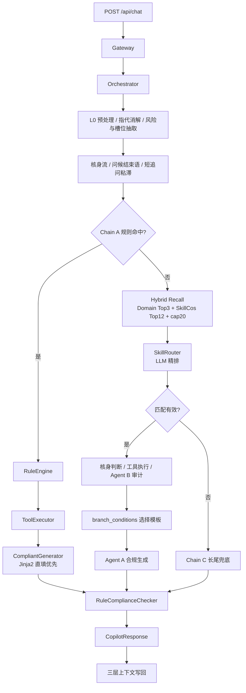

# 金融客服坐席话术推荐系统项目说明

> 生成时间：2026-04-28  
> 适用范围：当前 `weixin` 仓库的 Skill-based 实现  
> 代码入口：`fin_copilot/main.py`、`fin_copilot/orchestrator.py`

## 1. 项目定位

本项目是一个面向金融客服坐席的实时话术推荐系统。它不是直接面向客户的机器人，而是给人工坐席提供：

- 场景识别与 Skill 匹配
- 账户、账单、贷款、会员、额度、退款、短信、通话、停催、工单等辅助查询
- 标准话术推荐
- 多轮沟通状态维护
- 核身拦截
- 合规检查与长尾兜底

当前版本已经从早期 RAG-first demo 演进为 Skill-based 三链路架构。主知识不再依赖运行时向量检索，而是把 SOP 中的业务场景、触发条件、工具依赖、模板话术、分支条件和合规要求组织成结构化 Skill。

## 2. 当前代码结构

```text
fin_copilot/
├── main.py                         # FastAPI 应用入口与组件装配
├── orchestrator.py                 # 全链路主编排器
├── config.py                       # 路径、LLM、Embedding、路由、合规配置
├── routers/gateway.py              # /api/chat 网关
├── models/                         # ConversationState / Skill / Response 等模型
├── context/                        # 三层上下文、指代消解、短追问粘滞
├── routing/                        # 规则、域分类、Skill Router、Skill 向量索引
├── skills/                         # Skill 加载与分支表达式选择
├── agents/                         # Agent A 生成、Agent B 审计、长尾推理
├── compliance/                     # 后置规则合规检查
├── knowledge/                      # 活动/增值服务结构化知识检索
├── llm/                            # OpenAI-compatible LLM 客户端
└── utils/                          # trace、模板填充等工具

skills/
├── registry.json                   # 54 个 Skill 的域索引
├── SCHEMA.md                       # Skill YAML 结构规范
├── definitions/                    # 一个 Skill 一个 YAML
├── prompts/
│   ├── skill_routing.md            # Chain B Router prompt
│   ├── compliant_gen.md            # Agent A 生成 prompt
│   ├── longtail_reasoning.md       # Chain C 长尾 prompt
│   └── boundary_rules.yaml         # 高频混淆 Skill 判别规则
└── references/compliance/          # 违禁词、关键规则、长尾约束

rules/
└── rule_engine.json                # Chain A 规则短路配置，当前 9 条

tools/
├── registry.py                     # 11 个业务工具注册表
├── executor.py                     # 并行工具执行 + TTL 缓存
└── *.py                            # Mock 工具实现

golden_test.jsonl                   # 当前 merged 多轮黄金测试集
raw_test.jsonl                      # 旧单 query 测试集

tests/
├── EVAL_RUNBOOK.md                 # 评测说明
└── eval/                           # Exp1/Exp2/Exp3 评测脚本
```

## 3. 整体框架

当前系统以 `Orchestrator` 为中心，按“确定性优先”的原则处理每一轮客户输入。




核心运行顺序：

1. `Gateway` 接收 `/api/chat` 请求，把 `session_id` 和 `user_text` 交给 `Orchestrator.handle_turn()`。
2. `ContextManager` 获取会话状态，执行输入归一化、指代消解、风险标签识别、槽位抽取。
3. 未核身客户如果一次性提供姓名、手机号、身份证后四位，会直接完成核身；否则涉及账户数据时进入分步核身。
4. 纯问候、结束语、短追问可零 LLM 处理，避免无意义进入主路由。
5. Chain A 先尝试规则短路；未命中再进入 Chain B。
6. Chain B 使用 hybrid recall 构造候选 Skill，再由 LLM Router 精排。
7. 匹配成功后按 Skill 声明执行工具、审计置信度、选择模板分支、生成话术。
8. 无匹配或极低置信进入 Chain C 长尾兜底。
9. 所有输出都经过后置合规检查，再写回上下文。

## 4. 三条链路

### 4.1 Chain A：规则短路

Chain A 面向高频、确定性、误判风险低的场景。当前 `rules/rule_engine.json` 有 9 条规则，例如停止营销、增值服务咨询、开具结清证明、注销账户、取消会员、咨询还款方式、停止催收、协商还款、查询账单。

执行形态：

```text
query
  -> RuleEngine.match()
  -> 命中 skill_id + template_variant
  -> 判断是否需要核身
  -> 执行 required tools
  -> CompliantGenerator 优先 Jinja2 直填
  -> RuleComplianceChecker 后置检查
  -> 返回 route_a
```

Chain A 的关键点不是“绕开 Skill”，而是用规则直接定位 Skill。后续仍复用 Skill 模板、工具声明和合规规则。

### 4.2 Chain B：Skill 路由主链路

Chain B 是当前主链路，处理大多数标准业务问题。默认配置来自 `fin_copilot/config.py`：

```text
ENABLE_HYBRID_SKILL_RECALL = True
SKILL_MULTI_DOMAIN_K = 3
SKILL_COS_TOP_M = 12
SKILL_MAX_CANDIDATES = 20
SKILL_CANDIDATE_SOURCE = hybrid
PRIOR_SKILL_WEIGHT = 0.65
PRIOR_DOMAIN_WEIGHT = 0.25
PRIOR_KEYWORD_WEIGHT = 0.10
```

Chain B 的候选召回方式：

```text
query embedding
  -> EmbeddingDomainClassifier 取 domain Top3
  -> SkillEmbeddingIndex 取 skill_cos Top12
  -> 候选集合 = domain Top3 下全部 Skill + skill_cos Top12 Skill
  -> 去重
  -> prior_score 排序
  -> cap20
  -> SkillRouter.route_over_candidates()
```

`prior_score` 是弱先验，只用于排序和展示，不直接替代 LLM 判断：

```text
prior_score = 0.65 * skill_cos
            + 0.25 * domain_cos_of_skill_domain
            + 0.10 * keyword_overlap
```

Skill Router prompt 会注入：

- 当前候选 Skill 列表
- skill_cos / domain_cos / prior_score
- 最近对话窗口
- 叙事摘要与事件日志
- 当前 skill、轮次、已收集槽位、缺失槽位
- 风险标签
- 上一轮坐席回复
- 当前候选涉及的 `boundary_rules.yaml` 混淆簇规则
- 可选 few-shot 相似案例

匹配后执行：

```text
SkillMatch
  -> 若 none 或极低置信，进入 Chain C
  -> 若涉及账户数据且未核身，进入核身
  -> 合并 extracted_slots
  -> 执行 tools_needed 或 Skill required tools
  -> ConfidenceAuditor 规则审计
  -> branch_conditions 选择模板变体
  -> CompliantGenerator 生成话术
  -> RuleComplianceChecker 后置合规
  -> 重复回复保护
  -> 返回 route_b
```

### 4.3 Chain C：长尾兜底

Chain C 处理无 Skill 覆盖、Router 低置信、候选无效或审计失败的场景。它不会假装命中 SOP，而是返回带风险提示的保守回答。

执行形态：

```text
query
  -> LongtailReasoner._suggest_tools()
  -> 如涉及账户数据且未核身，先核身
  -> 已核身则执行只读工具
  -> LLM 长尾推理
  -> RuleComplianceChecker(is_longtail=True)
  -> 强制追加“以上信息仅供参考，具体以业务确认为准”
  -> 返回 route_c_fallback
```

当前 Chain C 允许建议只读工具，不允许写操作；`submit_ticket` 这类写工具不会作为长尾链路默认工具。

## 5. Skill 组织形式

### 5.1 总体规模

当前 `skills/registry.json` 登记 54 个 Skill，覆盖 10 个业务域 + 1 个会话流程域。

| 域       | 数量 | skill_id                                                     |
| -------- | ---: | ------------------------------------------------------------ |
| 会话流程 |    5 | `greeting_opening`, `identity_readback`, `acknowledgement`, `channel_check`, `closing` |
| 账户     |    3 | `account_cancellation`, `deactivated_customer_service`, `special_account_cancellation` |
| 还款     |    8 | `bill_date_credit_impact`, `card_rebinding`, `deduction_issues`, `early_deduction`, `early_loan_clearance`, `repayment_method_inquiry`, `repayment_result_query`, `repayment_status_issue` |
| 费用     |    9 | `bill_deduction_query`, `fee_consultation_tier1`, `fee_consultation_tier2`, `fee_detail_query`, `fee_refund_status`, `fee_refund_tier1`, `fee_refund_tier2`, `loan_dispute_refund`, `overpayment_refund` |
| 业务办理 |    7 | `cancel_credit_authorization`, `clearance_certificate`, `contract_retrieval`, `credit_inquiry`, `credit_modification`, `invoice_issuance`, `other_certificate` |
| 活动     |    5 | `cancel_value_added_service`, `light_card_cancel_refund`, `refund_value_added_service`, `stop_marketing`, `value_added_service_inquiry` |
| 逾期     |    5 | `close_pre_reminder`, `collection_complaint`, `overdue_negotiation`, `post_loan_verification`, `stop_collection` |
| 贷款     |    4 | `disbursement_progress`, `loan_consultation`, `loan_termination`, `remote_disbursement` |
| 会员     |    3 | `member_cancel`, `member_consultation`, `member_refund`      |
| 额度     |    2 | `no_quota_issue`, `quota_consultation`                       |
| 优享卡   |    3 | `premium_card_cancel`, `premium_card_inquiry`, `premium_card_refund` |

按运行模式：

| route_mode     | 数量 | 说明                                           |
| -------------- | ---: | ---------------------------------------------- |
| `tool_only`    |   39 | 需要工具数据，主要靠模板和规则生成             |
| `direct_reply` |    9 | 低风险通用咨询，可直接回复                     |
| `tool_rag`     |    6 | 复杂场景，保留补充知识口径，主知识仍来自 Skill |

按风险等级：

| risk_level | 数量 |
| ---------- | ---: |
| `low`      |   17 |
| `medium`   |   25 |
| `high`     |   12 |

### 5.2 Skill 的文件形态

每个 `skills/definitions/*.yaml` 是一个完整业务能力单元。运行时由 `SkillLoader` 从 `registry.json` 建立域索引，再按需加载 YAML 并解析成 `SkillDefinition`。

核心字段：

| 字段                                | 作用                                                         |
| ----------------------------------- | ------------------------------------------------------------ |
| `skill_id` / `name` / `description` | Skill 标识、展示名、业务边界说明                             |
| `domain` / `intent_hierarchy`       | 一级域和多级意图层级                                         |
| `route_mode`                        | `direct_reply` / `tool_only` / `tool_rag`                    |
| `risk_level`                        | `low` / `medium` / `high`，参与核身和粘滞策略                |
| `triggers.keywords`                 | 触发词，用于 Router prompt、关键词重叠、规则沉淀             |
| `triggers.examples`                 | 真实或模拟客户说法，用于 Router 判别和 Skill 向量索引        |
| `triggers.exclude_keywords`         | 排除词，用于减少细粒度误判                                   |
| `tools.required` / `tools.optional` | 业务工具依赖                                                 |
| `templates`                         | 多轮、多状态话术模板，每个模板含 `script`、`required_slots`、`next_step` |
| `branch_conditions`                 | 分支条件，可用确定性 `expr` 或自然语言 `hint`                |
| `compliance`                        | Skill 级禁用表达、免责声明、条件性必含内容                   |
| `escalation` / `escalation_signals` | 升级/投诉/转人工触发信号                                     |
| `fallback`                          | 安全兜底话术                                                 |
| `slot_sources`                      | 模板槽位来源，说明字段来自工具、系统、用户输入、LLM 或派生值 |
| `priority`                          | 混淆场景优先级                                               |

### 5.3 Skill 不是普通 RAG chunk

Skill 的组织目标是保留 SOP 的决策结构，而不是把 SOP 拍平成可检索文本。一个 Skill 同时封装：

- 这个场景是什么、和相邻场景有什么区别
- 哪些用户表达应该触发
- 哪些表达必须排除
- 是否需要核身
- 要查哪些工具
- 不同轮次或不同状态下用哪套话术
- 哪些槽位必须有
- 槽位从哪里来
- 出现升级/投诉/高风险信号怎么办
- 输出时有哪些合规红线

因此运行时的主链路是“选 Skill -> 用 Skill”，而不是“检索 chunk -> 改写 chunk”。

### 5.4 示例：`repayment_status_issue`

`repayment_status_issue` 是一个典型的合并型 Skill，把还款失败、已还款未更新、部分扣款、重复扣款、对公还款未入账等客户视角相近的问题统一到“还款状态异常”入口。

核心特点：

- `domain`: 还款
- `route_mode`: `tool_only`
- `risk_level`: `medium`
- required tools: `get_customer_profile`, `get_bill_and_repayment_plan`
- optional tools: `get_loan_service_info`
- `templates.first_contact` 先核身
- `templates.follow_up` 查询账单与还款状态后继续诊断
- `branch_conditions` 用大量 hint 描述扣款失败、已还款未更新、部分扣款、重复扣款等分支
- `slot_sources` 明确 `bill_amount`、`customer_name`、`repayment_status` 等槽位来自哪个工具字段

它体现了当前 Skill 设计的一个重要原则：按客户真实诉求组织入口，再在 Skill 内用分支表达 SOP 差异。

## 6. 工具与数据层

工具注册在 `tools/registry.py`，当前共有 11 个：

| 工具                          | 权限  | 用途                       |
| ----------------------------- | ----- | -------------------------- |
| `get_customer_profile`        | read  | 客户档案                   |
| `get_bill_and_repayment_plan` | read  | 账单、还款、逾期、扣款状态 |
| `get_loan_service_info`       | read  | 贷款、放款、合同、贷款状态 |
| `get_membership_service_info` | read  | 会员服务                   |
| `get_quota_service_info`      | read  | 授信与额度                 |
| `get_call_history`            | read  | 通话/进线记录              |
| `get_sms_history`             | read  | 短信记录                   |
| `get_stop_collection_history` | read  | 停催记录                   |
| `get_refund_history`          | read  | 退款/退费记录              |
| `query_ticket`                | read  | 工单查询                   |
| `submit_ticket`               | write | 工单提交                   |

`tools/executor.py` 使用 `asyncio.gather` 并行执行工具，并支持 300 秒 TTL 缓存。工具结果会写入：

- `state.tool_cache`：避免短时间重复查询
- `state.slots`：供模板填充、分支判断、后续轮次复用

## 7. 核身层

核身逻辑集中在 `fin_copilot/orchestrator.py`。基本原则：

- 中高风险或明确查询个人账户数据的 Skill，需要先核身。
- 低风险产品介绍类问题不因 Skill 声明了工具就强制核身。
- 低风险 Skill 只有当客户说“我的、查询、账单、扣款、退款、记录、短信”等个人查询信号时才核身。
- 核身进行中时，优先处理核身输入，避免被普通业务路由打断。
- 支持“一句话核身”：客户一次性提供姓名、手机号、身份证后四位时可直接通过。

核身状态机：

```text
not_started
  -> asking_name
  -> asking_phone
  -> asking_id
  -> passed
  -> failed
```

核身通过后，原始业务问题会作为 `pending_query` 自动回放，继续进入原链路处理。

## 8. 上下文与多轮能力

当前会话状态由 `ConversationState` 维护，分三层：

| 层      | 实现                     | 内容                                                         | 作用                                     |
| ------- | ------------------------ | ------------------------------------------------------------ | ---------------------------------------- |
| Layer 1 | `SlidingWindow`          | 最近 8 轮原文                                                | Router 和 Generator 的近场上下文         |
| Layer 2 | `RollingSummary`         | 事件日志 + `narrative_summary`                               | 压缩较早对话，保留业务进展               |
| Layer 3 | `StructuredStateManager` | customer、intent、slots、tool_cache、risk_flags、compliance_state | 核身、路由、工具、模板、合规的结构化状态 |

多轮增强能力：

- `intent.current_skill_id` 和 `turn_in_skill` 支持递进话术。
- `DialogueStateManager.should_stick()` 处理“嗯、那呢、怎么办、继续”等短追问。
- `resolve_references()` 保守处理“这个、那个、刚才那个”等指代。
- `duplicate_ratio()` 防止连续输出高度相似的话术。
- 意图切换时清理场景专属槽位，只保留通用槽位与部分业务锚点。

## 9. 合规体系

合规由两部分组成：

1. 前置约束：写在 `skills/prompts/compliant_gen.md` 和每个 Skill 的 `compliance` 字段中。
2. 后置检查：`RuleComplianceChecker` 对所有输出执行规则检查。

后置规则共 6 层：

| 层   | 内容                                           |
| ---- | ---------------------------------------------- |
| 1    | 全局违禁词                                     |
| 2    | Skill 级禁用表达                               |
| 3    | 超权表述检查，涉及减免/免息/退还等需补免责声明 |
| 4    | 长尾链路加严，禁止操作承诺并强制追加参考声明   |
| 5    | PII 泄露检测                                   |
| 6    | Skill required disclaimer 自动补充             |

如果检测到 PII 泄露等严重问题，会转人工而不是继续输出普通话术。

## 10. 活动/增值服务知识

活动、增值服务类问题使用额外的结构化知识层：

```text
sop/structured/value_added_text/services.json
sop/structured/value_added_text/text_blocks.jsonl
sop/structured/value_added_images/image_blocks.jsonl
```

`ValueAddedKnowledgeRetriever` 只对以下 Skill 生效：

- `value_added_service_inquiry`
- `cancel_value_added_service`
- `refund_value_added_service`
- `light_card_cancel_refund`

它会先匹配服务别名，再按客户意图挑选文本块和图片块，把补充信息注入 Agent A prompt。若客户提到的产品无法匹配，会返回 unmatched context，让系统澄清而不是编造产品信息。

## 11. 评测与验证

旧单 query 评测集是 `raw_test.jsonl`。推荐入口是：

```bash
bash scripts/run_golden_full_eval.sh
```

评测分三层：

| 实验 | 脚本                                    | 目标                         |
| ---- | --------------------------------------- | ---------------------------- |
| Exp1 | `tests/eval/exp1_l1_domain.py`          | L1 域分类 Top1/TopK          |
| Exp2 | `tests/eval/exp2_skill_match.py`        | Skill Router Top1/Top3       |
| Exp3 | `tests/eval/exp3_chain_distribution.py` | 完整链路路由分布、延迟、合规 |

当前 4.25 报告中记录的同批次口径：

| 指标                        |  当前结果 |
| --------------------------- | --------: |
| Exp1 L1 域分类 Top1         |    76.60% |
| Exp1 L1 域分类 Top3         |    94.59% |
| Exp2 Skill-cos Top12 recall |    95.57% |
| Exp2 Skill Router Top1      |    76.11% |
| Exp2 Skill Router Top3      |    90.79% |
| Hybrid 合并候选覆盖         | 约 98.14% |

注意这些指标有不同口径：

- Domain Top3 是域召回覆盖。
- Skill-cos Top12 是 Skill 级候选覆盖。
- Router Top1/Top3 是 LLM 在候选池内的最终精排结果。

不要把三者混成同一个“准确率”。

## 12. 新增或修改 Skill 的推荐流程

1. 在 `skills/registry.json` 对应 domain 下登记 `skill_id`。
2. 在 `skills/definitions/` 新增同名 YAML。
3. 补齐 `triggers.keywords/examples/exclude_keywords`，特别是容易混淆的排除词。
4. 声明 `tools.required/optional`，并确保工具存在于 `tools/registry.py`。
5. 编写 `templates`，每个占位符都要在 `slot_sources` 中说明来源。
6. 如果有确定性分支，优先用 `branch_conditions[].expr`；无法结构化的分支用 `hint`。
7. 配置 `compliance`、`fallback`、`risk_level`、必要的 `escalation_signals`。
8. 若属于高频混淆场景，补充 `skills/prompts/boundary_rules.yaml`。
9. 运行校验：

```bash
python scripts/validate_skills.py
python -m pytest tests/unit/test_skill_schema.py
```

10. 用小样本 Exp2/CLI 回归，再决定是否进入全量 golden。

## 13. 当前链路的关键边界

- Chain A 是规则定位 Skill，不是独立话术系统。
- Chain B 的 hybrid recall 是候选扩展，不是最终分类器。
- Skill-cos 是弱先验，不能覆盖明确的业务边界、排除词和上下文状态。
- 核身是业务查询前的统一门，不应该散落到各个工具或模板里。
- Tool 返回的数据是事实来源，LLM 不应自行编造账户、账单、退款、额度等信息。
- Chain C 必须明确“无 SOP 覆盖/仅供参考”，不能强行装成标准 Skill 命中。
- 合规既要在 prompt 中前置，也必须以后置规则兜底。

## 14. 接手时优先看的文件

| 目的             | 文件                                                       |
| ---------------- | ---------------------------------------------------------- |
| 看主链路         | `fin_copilot/orchestrator.py`                              |
| 看组件装配       | `fin_copilot/main.py`                                      |
| 看配置默认值     | `fin_copilot/config.py`                                    |
| 看 Skill 结构    | `skills/SCHEMA.md`                                         |
| 看 Skill 列表    | `skills/registry.json`                                     |
| 看具体 Skill     | `skills/definitions/*.yaml`                                |
| 看 Router prompt | `skills/prompts/skill_routing.md`                          |
| 看生成 prompt    | `skills/prompts/compliant_gen.md`                          |
| 看规则短路       | `rules/rule_engine.json`                                   |
| 看工具能力       | `tools/registry.py`                                        |
| 看评测入口       | `scripts/run_golden_full_eval.sh`、`tests/EVAL_RUNBOOK.md` |


核心运行顺序：

1. `Gateway` 接收 `/api/chat` 请求，把 `session_id` 和 `user_text` 交给 `Orchestrator.handle_turn()`。
2. `ContextManager` 获取会话状态，执行输入归一化、指代消解、风险标签识别、槽位抽取。
3. 未核身客户如果一次性提供姓名、手机号、身份证后四位，会直接完成核身；否则涉及账户数据时进入分步核身。
4. 纯问候、结束语、短追问可零 LLM 处理，避免无意义进入主路由。
5. Chain A 先尝试规则短路；未命中再进入 Chain B。
6. Chain B 使用 hybrid recall 构造候选 Skill，再由 LLM Router 精排。
7. 匹配成功后按 Skill 声明执行工具、审计置信度、选择模板分支、生成话术。
8. 无匹配或极低置信进入 Chain C 长尾兜底。
9. 所有输出都经过后置合规检查，再写回上下文。

## 4. 三条链路

### 4.1 Chain A：规则短路

Chain A 面向高频、确定性、误判风险低的场景。当前 `rules/rule_engine.json` 有 9 条规则，例如停止营销、增值服务咨询、开具结清证明、注销账户、取消会员、咨询还款方式、停止催收、协商还款、查询账单。

执行形态：

```text
query
  -> RuleEngine.match()
  -> 命中 skill_id + template_variant
  -> 判断是否需要核身
  -> 执行 required tools
  -> CompliantGenerator 优先 Jinja2 直填
  -> RuleComplianceChecker 后置检查
  -> 返回 route_a
```

Chain A 的关键点不是“绕开 Skill”，而是用规则直接定位 Skill。后续仍复用 Skill 模板、工具声明和合规规则。

### 4.2 Chain B：Skill 路由主链路

Chain B 是当前主链路，处理大多数标准业务问题。默认配置来自 `fin_copilot/config.py`：

```text
ENABLE_HYBRID_SKILL_RECALL = True
SKILL_MULTI_DOMAIN_K = 3
SKILL_COS_TOP_M = 12
SKILL_MAX_CANDIDATES = 20
SKILL_CANDIDATE_SOURCE = hybrid
PRIOR_SKILL_WEIGHT = 0.65
PRIOR_DOMAIN_WEIGHT = 0.25
PRIOR_KEYWORD_WEIGHT = 0.10
```

Chain B 的候选召回方式：

```text
query embedding
  -> EmbeddingDomainClassifier 取 domain Top3
  -> SkillEmbeddingIndex 取 skill_cos Top12
  -> 候选集合 = domain Top3 下全部 Skill + skill_cos Top12 Skill
  -> 去重
  -> prior_score 排序
  -> cap20
  -> SkillRouter.route_over_candidates()
```

`prior_score` 是弱先验，只用于排序和展示，不直接替代 LLM 判断：

```text
prior_score = 0.65 * skill_cos
            + 0.25 * domain_cos_of_skill_domain
            + 0.10 * keyword_overlap
```

Skill Router prompt 会注入：

- 当前候选 Skill 列表
- skill_cos / domain_cos / prior_score
- 最近对话窗口
- 叙事摘要与事件日志
- 当前 skill、轮次、已收集槽位、缺失槽位
- 风险标签
- 上一轮坐席回复
- 当前候选涉及的 `boundary_rules.yaml` 混淆簇规则
- 可选 few-shot 相似案例

匹配后执行：

```text
SkillMatch
  -> 若 none 或极低置信，进入 Chain C
  -> 若涉及账户数据且未核身，进入核身
  -> 合并 extracted_slots
  -> 执行 tools_needed 或 Skill required tools
  -> ConfidenceAuditor 规则审计
  -> branch_conditions 选择模板变体
  -> CompliantGenerator 生成话术
  -> RuleComplianceChecker 后置合规
  -> 重复回复保护
  -> 返回 route_b
```

### 4.3 Chain C：长尾兜底

Chain C 处理无 Skill 覆盖、Router 低置信、候选无效或审计失败的场景。它不会假装命中 SOP，而是返回带风险提示的保守回答。

执行形态：

```text
query
  -> LongtailReasoner._suggest_tools()
  -> 如涉及账户数据且未核身，先核身
  -> 已核身则执行只读工具
  -> LLM 长尾推理
  -> RuleComplianceChecker(is_longtail=True)
  -> 强制追加“以上信息仅供参考，具体以业务确认为准”
  -> 返回 route_c_fallback
```

当前 Chain C 允许建议只读工具，不允许写操作；`submit_ticket` 这类写工具不会作为长尾链路默认工具。

## 5. Skill 组织形式

### 5.1 总体规模

当前 `skills/registry.json` 登记 54 个 Skill，覆盖 10 个业务域 + 1 个会话流程域。

| 域 | 数量 | skill_id |
|---|---:|---|
| 会话流程 | 5 | `greeting_opening`, `identity_readback`, `acknowledgement`, `channel_check`, `closing` |
| 账户 | 3 | `account_cancellation`, `deactivated_customer_service`, `special_account_cancellation` |
| 还款 | 8 | `bill_date_credit_impact`, `card_rebinding`, `deduction_issues`, `early_deduction`, `early_loan_clearance`, `repayment_method_inquiry`, `repayment_result_query`, `repayment_status_issue` |
| 费用 | 9 | `bill_deduction_query`, `fee_consultation_tier1`, `fee_consultation_tier2`, `fee_detail_query`, `fee_refund_status`, `fee_refund_tier1`, `fee_refund_tier2`, `loan_dispute_refund`, `overpayment_refund` |
| 业务办理 | 7 | `cancel_credit_authorization`, `clearance_certificate`, `contract_retrieval`, `credit_inquiry`, `credit_modification`, `invoice_issuance`, `other_certificate` |
| 活动 | 5 | `cancel_value_added_service`, `light_card_cancel_refund`, `refund_value_added_service`, `stop_marketing`, `value_added_service_inquiry` |
| 逾期 | 5 | `close_pre_reminder`, `collection_complaint`, `overdue_negotiation`, `post_loan_verification`, `stop_collection` |
| 贷款 | 4 | `disbursement_progress`, `loan_consultation`, `loan_termination`, `remote_disbursement` |
| 会员 | 3 | `member_cancel`, `member_consultation`, `member_refund` |
| 额度 | 2 | `no_quota_issue`, `quota_consultation` |
| 优享卡 | 3 | `premium_card_cancel`, `premium_card_inquiry`, `premium_card_refund` |

按运行模式：

| route_mode | 数量 | 说明 |
|---|---:|---|
| `tool_only` | 39 | 需要工具数据，主要靠模板和规则生成 |
| `direct_reply` | 9 | 低风险通用咨询，可直接回复 |
| `tool_rag` | 6 | 复杂场景，保留补充知识口径，主知识仍来自 Skill |

按风险等级：

| risk_level | 数量 |
|---|---:|
| `low` | 17 |
| `medium` | 25 |
| `high` | 12 |

### 5.2 Skill 的文件形态

每个 `skills/definitions/*.yaml` 是一个完整业务能力单元。运行时由 `SkillLoader` 从 `registry.json` 建立域索引，再按需加载 YAML 并解析成 `SkillDefinition`。

核心字段：

| 字段 | 作用 |
|---|---|
| `skill_id` / `name` / `description` | Skill 标识、展示名、业务边界说明 |
| `domain` / `intent_hierarchy` | 一级域和多级意图层级 |
| `route_mode` | `direct_reply` / `tool_only` / `tool_rag` |
| `risk_level` | `low` / `medium` / `high`，参与核身和粘滞策略 |
| `triggers.keywords` | 触发词，用于 Router prompt、关键词重叠、规则沉淀 |
| `triggers.examples` | 真实或模拟客户说法，用于 Router 判别和 Skill 向量索引 |
| `triggers.exclude_keywords` | 排除词，用于减少细粒度误判 |
| `tools.required` / `tools.optional` | 业务工具依赖 |
| `templates` | 多轮、多状态话术模板，每个模板含 `script`、`required_slots`、`next_step` |
| `branch_conditions` | 分支条件，可用确定性 `expr` 或自然语言 `hint` |
| `compliance` | Skill 级禁用表达、免责声明、条件性必含内容 |
| `escalation` / `escalation_signals` | 升级/投诉/转人工触发信号 |
| `fallback` | 安全兜底话术 |
| `slot_sources` | 模板槽位来源，说明字段来自工具、系统、用户输入、LLM 或派生值 |
| `priority` | 混淆场景优先级 |

### 5.3 Skill 不是普通 RAG chunk

Skill 的组织目标是保留 SOP 的决策结构，而不是把 SOP 拍平成可检索文本。一个 Skill 同时封装：

- 这个场景是什么、和相邻场景有什么区别
- 哪些用户表达应该触发
- 哪些表达必须排除
- 是否需要核身
- 要查哪些工具
- 不同轮次或不同状态下用哪套话术
- 哪些槽位必须有
- 槽位从哪里来
- 出现升级/投诉/高风险信号怎么办
- 输出时有哪些合规红线

因此运行时的主链路是“选 Skill -> 用 Skill”，而不是“检索 chunk -> 改写 chunk”。

### 5.4 示例：`repayment_status_issue`

`repayment_status_issue` 是一个典型的合并型 Skill，把还款失败、已还款未更新、部分扣款、重复扣款、对公还款未入账等客户视角相近的问题统一到“还款状态异常”入口。

核心特点：

- `domain`: 还款
- `route_mode`: `tool_only`
- `risk_level`: `medium`
- required tools: `get_customer_profile`, `get_bill_and_repayment_plan`
- optional tools: `get_loan_service_info`
- `templates.first_contact` 先核身
- `templates.follow_up` 查询账单与还款状态后继续诊断
- `branch_conditions` 用大量 hint 描述扣款失败、已还款未更新、部分扣款、重复扣款等分支
- `slot_sources` 明确 `bill_amount`、`customer_name`、`repayment_status` 等槽位来自哪个工具字段

它体现了当前 Skill 设计的一个重要原则：按客户真实诉求组织入口，再在 Skill 内用分支表达 SOP 差异。

## 6. 工具与数据层

工具注册在 `tools/registry.py`，当前共有 11 个：

| 工具 | 权限 | 用途 |
|---|---|---|
| `get_customer_profile` | read | 客户档案 |
| `get_bill_and_repayment_plan` | read | 账单、还款、逾期、扣款状态 |
| `get_loan_service_info` | read | 贷款、放款、合同、贷款状态 |
| `get_membership_service_info` | read | 会员服务 |
| `get_quota_service_info` | read | 授信与额度 |
| `get_call_history` | read | 通话/进线记录 |
| `get_sms_history` | read | 短信记录 |
| `get_stop_collection_history` | read | 停催记录 |
| `get_refund_history` | read | 退款/退费记录 |
| `query_ticket` | read | 工单查询 |
| `submit_ticket` | write | 工单提交 |

`tools/executor.py` 使用 `asyncio.gather` 并行执行工具，并支持 300 秒 TTL 缓存。工具结果会写入：

- `state.tool_cache`：避免短时间重复查询
- `state.slots`：供模板填充、分支判断、后续轮次复用

## 7. 核身层

核身逻辑集中在 `fin_copilot/orchestrator.py`。基本原则：

- 中高风险或明确查询个人账户数据的 Skill，需要先核身。
- 低风险产品介绍类问题不因 Skill 声明了工具就强制核身。
- 低风险 Skill 只有当客户说“我的、查询、账单、扣款、退款、记录、短信”等个人查询信号时才核身。
- 核身进行中时，优先处理核身输入，避免被普通业务路由打断。
- 支持“一句话核身”：客户一次性提供姓名、手机号、身份证后四位时可直接通过。

核身状态机：

```text
not_started
  -> asking_name
  -> asking_phone
  -> asking_id
  -> passed
  -> failed
```

核身通过后，原始业务问题会作为 `pending_query` 自动回放，继续进入原链路处理。

## 8. 上下文与多轮能力

当前会话状态由 `ConversationState` 维护，分三层：

| 层 | 实现 | 内容 | 作用 |
|---|---|---|---|
| Layer 1 | `SlidingWindow` | 最近 8 轮原文 | Router 和 Generator 的近场上下文 |
| Layer 2 | `RollingSummary` | 事件日志 + `narrative_summary` | 压缩较早对话，保留业务进展 |
| Layer 3 | `StructuredStateManager` | customer、intent、slots、tool_cache、risk_flags、compliance_state | 核身、路由、工具、模板、合规的结构化状态 |

多轮增强能力：

- `intent.current_skill_id` 和 `turn_in_skill` 支持递进话术。
- `DialogueStateManager.should_stick()` 处理“嗯、那呢、怎么办、继续”等短追问。
- `resolve_references()` 保守处理“这个、那个、刚才那个”等指代。
- `duplicate_ratio()` 防止连续输出高度相似的话术。
- 意图切换时清理场景专属槽位，只保留通用槽位与部分业务锚点。

## 9. 合规体系

合规由两部分组成：

1. 前置约束：写在 `skills/prompts/compliant_gen.md` 和每个 Skill 的 `compliance` 字段中。
2. 后置检查：`RuleComplianceChecker` 对所有输出执行规则检查。

后置规则共 6 层：

| 层 | 内容 |
|---|---|
| 1 | 全局违禁词 |
| 2 | Skill 级禁用表达 |
| 3 | 超权表述检查，涉及减免/免息/退还等需补免责声明 |
| 4 | 长尾链路加严，禁止操作承诺并强制追加参考声明 |
| 5 | PII 泄露检测 |
| 6 | Skill required disclaimer 自动补充 |

如果检测到 PII 泄露等严重问题，会转人工而不是继续输出普通话术。

## 10. 活动/增值服务知识

活动、增值服务类问题使用额外的结构化知识层：

```text
sop/structured/value_added_text/services.json
sop/structured/value_added_text/text_blocks.jsonl
sop/structured/value_added_images/image_blocks.jsonl
```

`ValueAddedKnowledgeRetriever` 只对以下 Skill 生效：

- `value_added_service_inquiry`
- `cancel_value_added_service`
- `refund_value_added_service`
- `light_card_cancel_refund`

它会先匹配服务别名，再按客户意图挑选文本块和图片块，把补充信息注入 Agent A prompt。若客户提到的产品无法匹配，会返回 unmatched context，让系统澄清而不是编造产品信息。

## 11. 评测与验证

旧单 query 评测集是 `raw_test.jsonl`。推荐入口是：

```bash
bash scripts/run_golden_full_eval.sh
```

评测分三层：

| 实验 | 脚本 | 目标 |
|---|---|---|
| Exp1 | `tests/eval/exp1_l1_domain.py` | L1 域分类 Top1/TopK |
| Exp2 | `tests/eval/exp2_skill_match.py` | Skill Router Top1/Top3 |
| Exp3 | `tests/eval/exp3_chain_distribution.py` | 完整链路路由分布、延迟、合规 |

当前 4.25 报告中记录的同批次口径：

| 指标 | 当前结果 |
|---|---:|
| Exp1 L1 域分类 Top1 | 76.60% |
| Exp1 L1 域分类 Top3 | 94.59% |
| Exp2 Skill-cos Top12 recall | 95.57% |
| Exp2 Skill Router Top1 | 76.11% |
| Exp2 Skill Router Top3 | 90.79% |
| Hybrid 合并候选覆盖 | 约 98.14% |

注意这些指标有不同口径：

- Domain Top3 是域召回覆盖。
- Skill-cos Top12 是 Skill 级候选覆盖。
- Router Top1/Top3 是 LLM 在候选池内的最终精排结果。

不要把三者混成同一个“准确率”。

## 12. 新增或修改 Skill 的推荐流程

1. 在 `skills/registry.json` 对应 domain 下登记 `skill_id`。
2. 在 `skills/definitions/` 新增同名 YAML。
3. 补齐 `triggers.keywords/examples/exclude_keywords`，特别是容易混淆的排除词。
4. 声明 `tools.required/optional`，并确保工具存在于 `tools/registry.py`。
5. 编写 `templates`，每个占位符都要在 `slot_sources` 中说明来源。
6. 如果有确定性分支，优先用 `branch_conditions[].expr`；无法结构化的分支用 `hint`。
7. 配置 `compliance`、`fallback`、`risk_level`、必要的 `escalation_signals`。
8. 若属于高频混淆场景，补充 `skills/prompts/boundary_rules.yaml`。
9. 运行校验：

```bash
python scripts/validate_skills.py
python -m pytest tests/unit/test_skill_schema.py
```

10. 用小样本 Exp2/CLI 回归，再决定是否进入全量 golden。

## 13. 当前链路的关键边界

- Chain A 是规则定位 Skill，不是独立话术系统。
- Chain B 的 hybrid recall 是候选扩展，不是最终分类器。
- Skill-cos 是弱先验，不能覆盖明确的业务边界、排除词和上下文状态。
- 核身是业务查询前的统一门，不应该散落到各个工具或模板里。
- Tool 返回的数据是事实来源，LLM 不应自行编造账户、账单、退款、额度等信息。
- Chain C 必须明确“无 SOP 覆盖/仅供参考”，不能强行装成标准 Skill 命中。
- 合规既要在 prompt 中前置，也必须以后置规则兜底。

## 14. 接手时优先看的文件

| 目的 | 文件 |
|---|---|
| 看主链路 | `fin_copilot/orchestrator.py` |
| 看组件装配 | `fin_copilot/main.py` |
| 看配置默认值 | `fin_copilot/config.py` |
| 看 Skill 结构 | `skills/SCHEMA.md` |
| 看 Skill 列表 | `skills/registry.json` |
| 看具体 Skill | `skills/definitions/*.yaml` |
| 看 Router prompt | `skills/prompts/skill_routing.md` |
| 看生成 prompt | `skills/prompts/compliant_gen.md` |
| 看规则短路 | `rules/rule_engine.json` |
| 看工具能力 | `tools/registry.py` |
| 看评测入口 | `scripts/run_golden_full_eval.sh`、`tests/EVAL_RUNBOOK.md` |
